<div align="center">

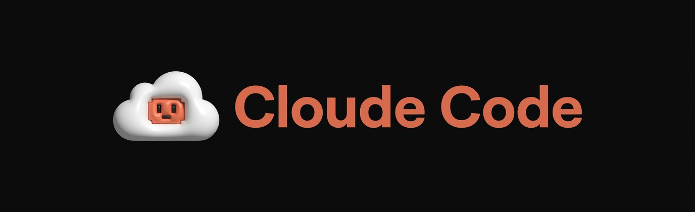

### Your Mac keeps coding. You keep the remote.

**Drive your Mac's live Claude Code sessions from your phone. Real terminal, real keystrokes, real control — while the session runs in tmux whether you're watching or not.**


-lightgrey)


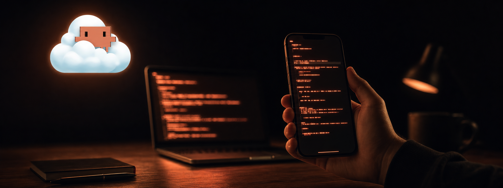

</div>

---

## The thing you couldn't do before

You start a Claude Code session on your Mac and walk away. Claude keeps working — and when it hits a permission prompt, your phone buzzes. You open a browser, tap in a 6-digit code, and you're staring at the exact same live terminal, cursor and all, from the subway. Type a follow-up. Approve the tool call. Watch the diff scroll by. Lock your phone.

The session never restarted, never lost context, and never needed an SSH client. When you get home and open your laptop, it's right where you left it — because it was never in the browser to begin with. It was in tmux the whole time.

---

## Contents

- [Screenshots](#screenshots)
- [Why this exists](#why-this-exists)
- [Features](#features)
- [How it works](#how-it-works)
- [Install](#install)
- [Upgrading and rolling back](#upgrading-and-rolling-back)
- [Configuration](#configuration)
- [Security model](#security-model)
- [Honest limits](#honest-limits)
- [Changelog](#changelog)
- [Contributing](#contributing)
- [License](#license)

---

## Screenshots

<div align="center">

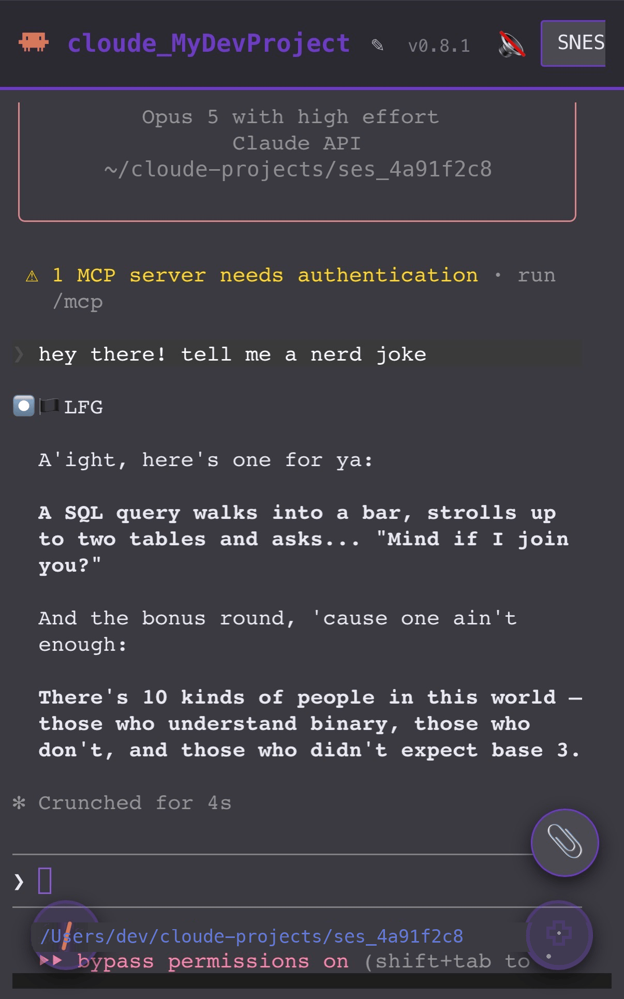
<br><b>Live terminal, mid-session</b><br><sub>Real iPhone screenshot, not a headless-browser render — an actual reply streaming in over the WebSocket.</sub>

<br><br>

<table>
<tr>
<td align="center" width="33%">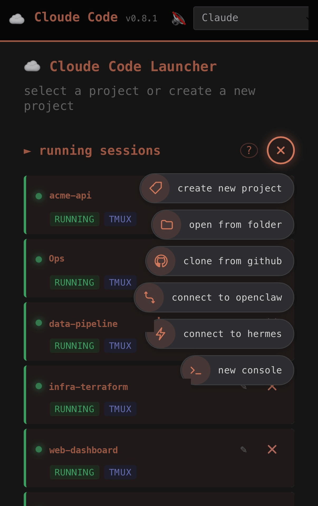<br><b>Six-way speed dial</b><br><sub>New project, folder, GitHub clone, OpenClaw, Hermes, or a bare console.</sub></td>
<td align="center" width="33%">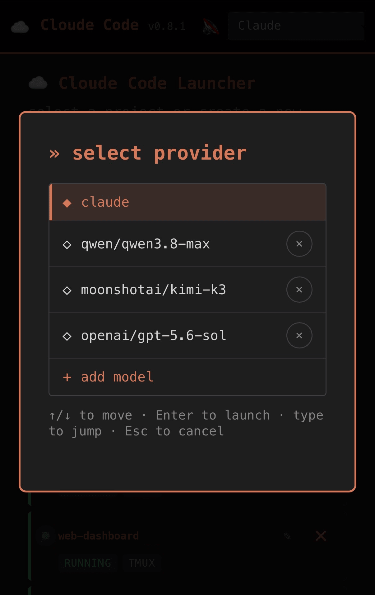<br><b>Provider selector</b><br><sub>Pinned Claude, plus qwen, kimi, and gpt models saved from OpenRouter.</sub></td>
<td align="center" width="33%">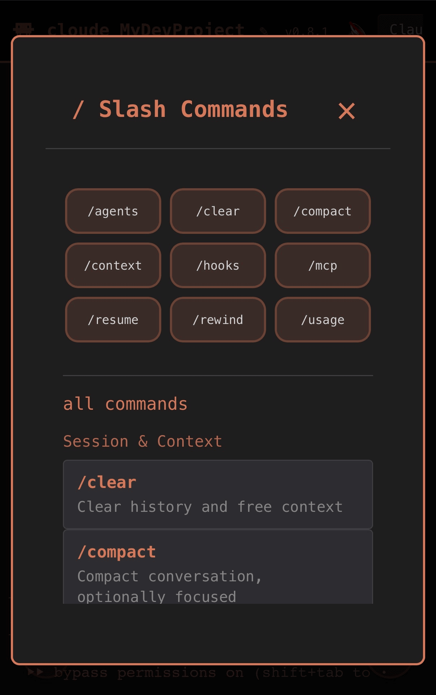<br><b>Slash palette</b><br><sub>74 Claude Code commands, grouped and tappable.</sub></td>
</tr>
<tr>
<td align="center" width="33%">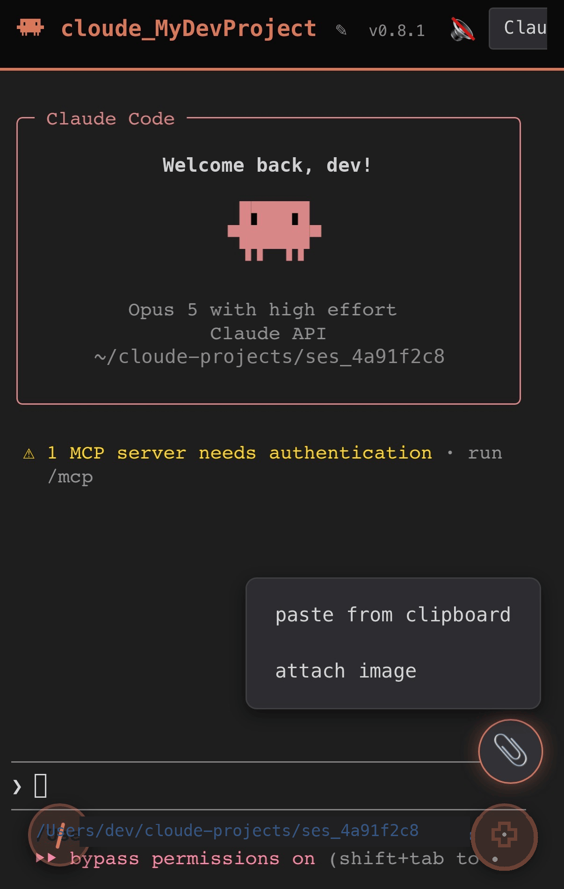<br><b>📎 clipboard menu</b><br><sub>Paste from clipboard or attach an image — no reliable paste event on iOS Safari.</sub></td>
<td align="center" width="33%">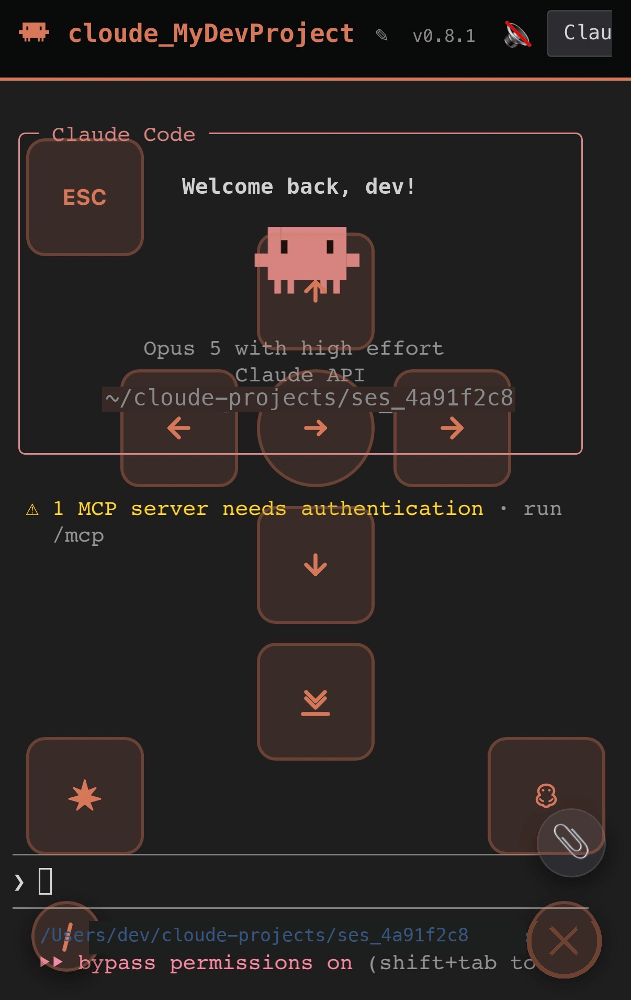<br><b>Virtual D-pad</b><br><sub>Arrows, Esc, Tab, Shift+Tab, jump-to-bottom — the keys phones don't have.</sub></td>
<td align="center" width="33%">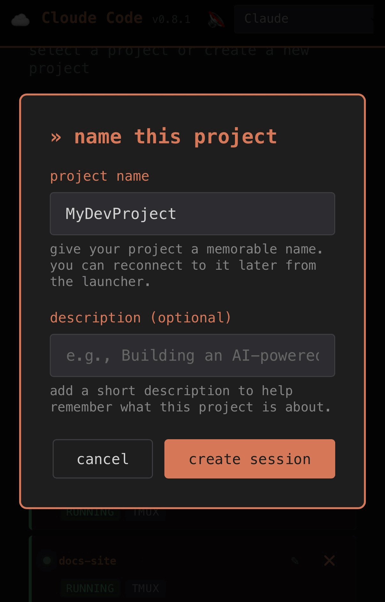<br><b>New project</b><br><sub>Name it, describe it (optional), and it's in the launcher for good.</sub></td>
</tr>
<tr>
<td align="center" width="33%">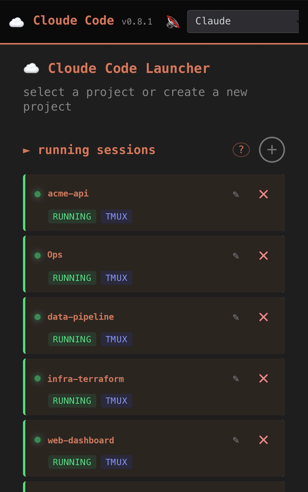<br><b>Running sessions</b><br><sub>Every RUNNING / TMUX session at a glance, refreshed every 5s.</sub></td>
<td align="center" width="33%">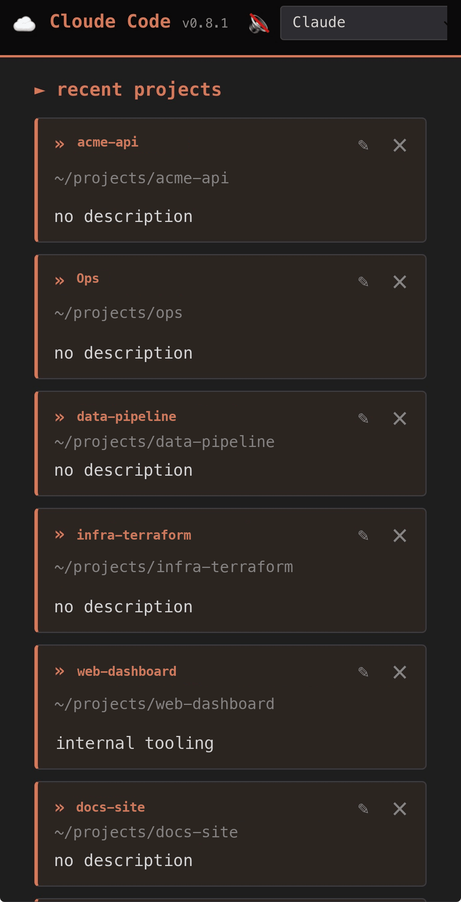<br><b>Recent projects</b><br><sub>Name, path, and description for every registered project.</sub></td>
<td align="center" width="33%">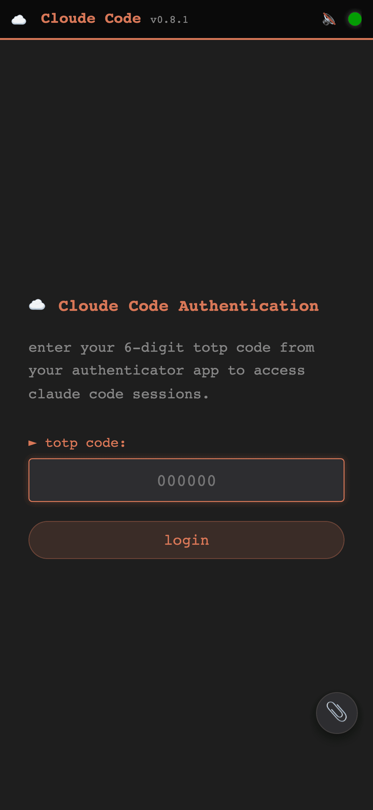<br><b>TOTP login</b><br><sub>No password. Six digits from your authenticator app.</sub></td>
</tr>
</table>

<sub><b>23 themes, one live session</b></sub>

<table>
<tr>
<td align="center" width="50%">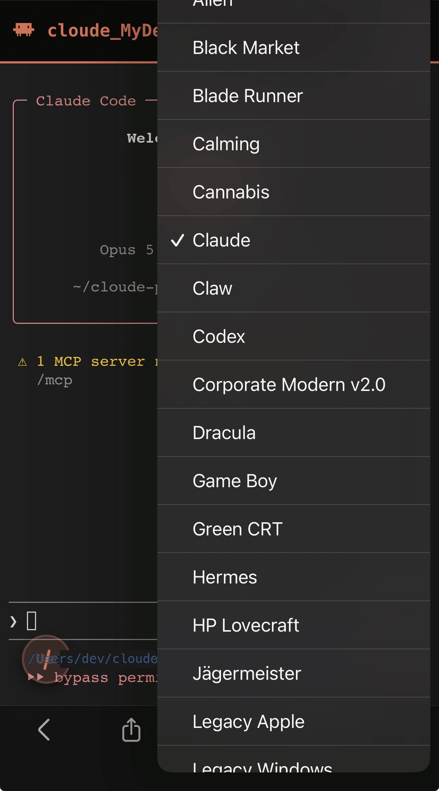<br><b>Native theme picker</b><br><sub>The real iOS dropdown — headless Chromium can't render this control. ~15 of 23 themes visible in one scroll.</sub></td>
<td align="center" width="50%">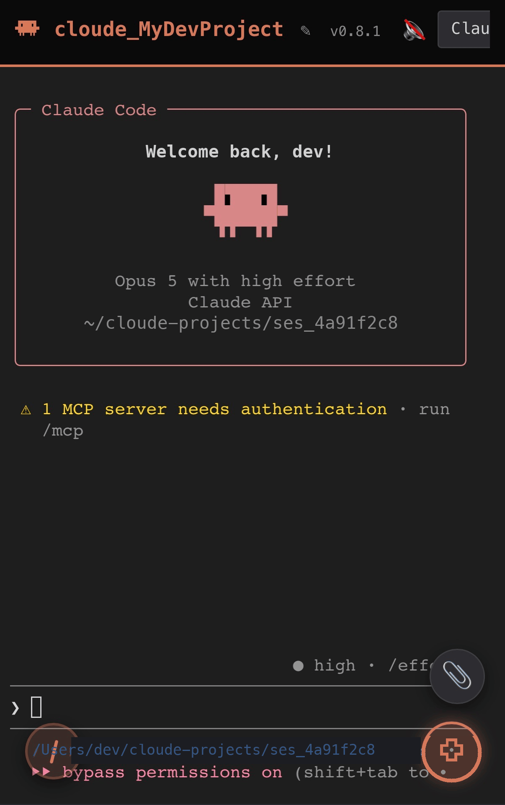<br><b>Claude theme, live</b><br><sub>The theme the picker has checked, running in the same session.</sub></td>
</tr>
</table>

<br>

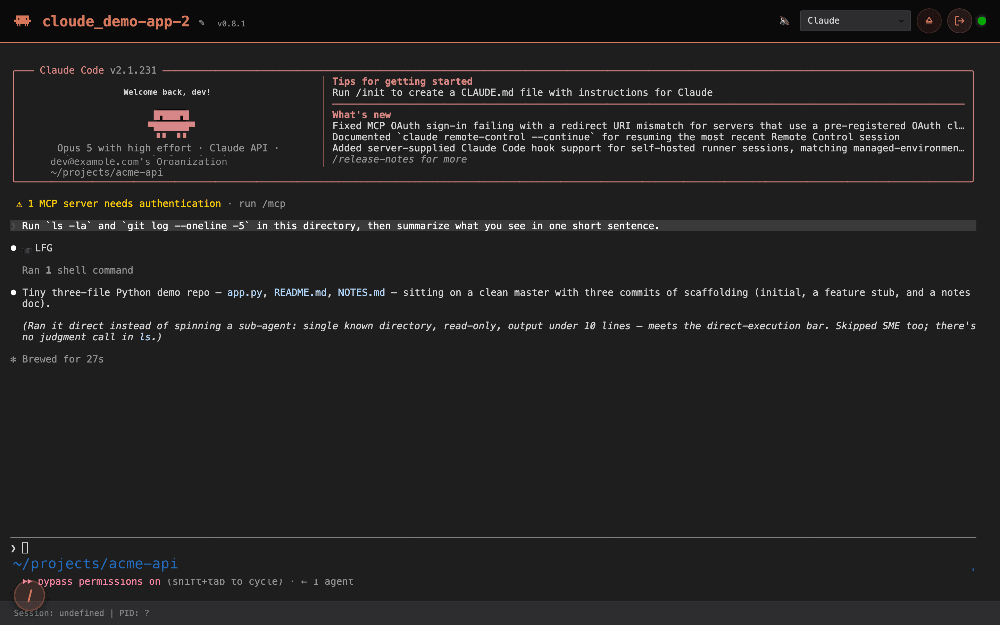
<br><sub><b>Desktop terminal</b> — same live session, full header chrome: theme picker, connection dot, destroy/logout.</sub>

<br><br>

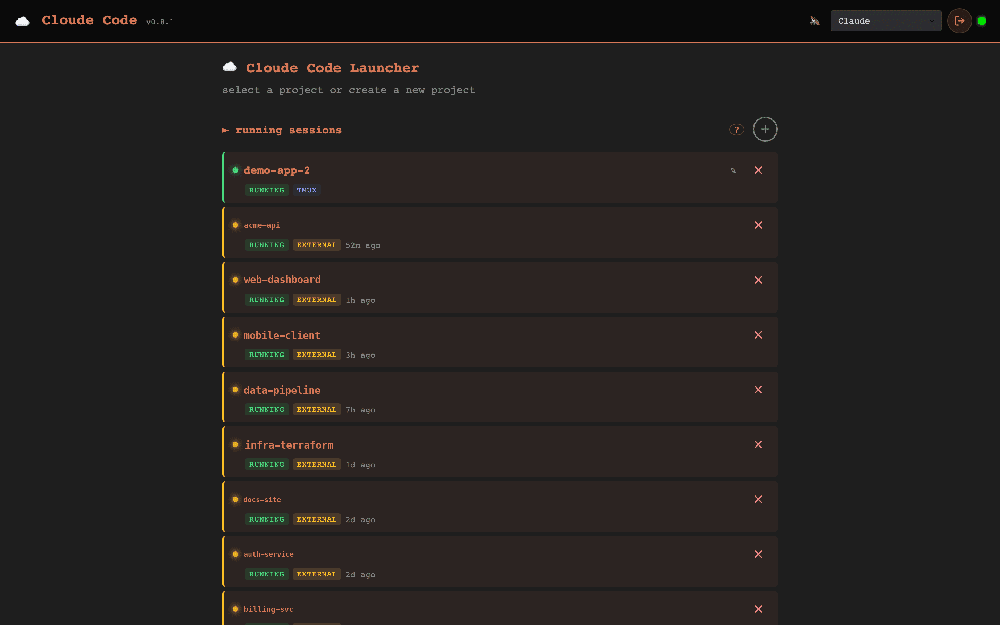
<br><sub><b>Desktop launcher</b> — running sessions at a glance, wide layout.</sub>

<br><br>

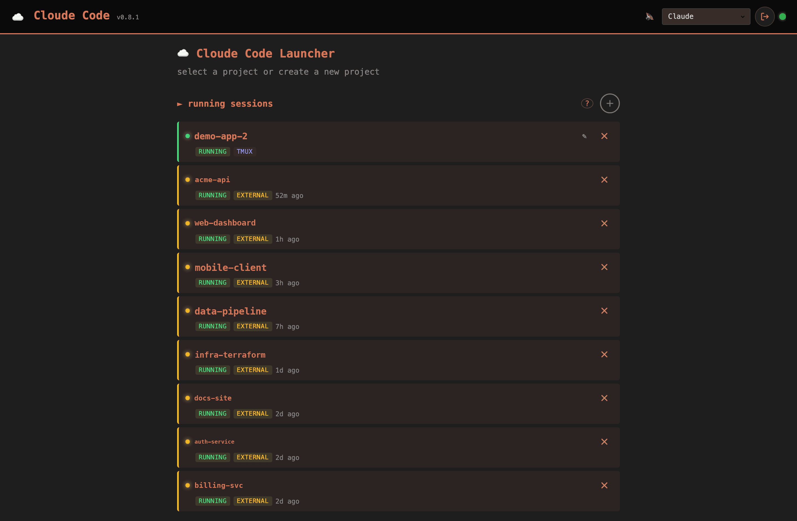
<br><sub><b>Running sessions</b> — Cloude-owned and adopted external sessions in one list, refreshed every 5 seconds.</sub>

</div>

---

## Why this exists

**You're chained to the desk.** A Claude Code run takes twenty minutes or two hours. The moment you walk away you're blind — and often the only thing it needs from you is a one-word answer. That was the entire premise of the first commit, and it still is.

**Terminals on phones are unusable.** No Tab key. Enter submits instead of inserting a newline. Backspace, Esc, and arrows get swallowed. You can't select text to copy an error message. Cloude Code fixes each of these individually instead of pretending a raw SSH client is fine on a 6-inch screen.

**Leaving a session shouldn't kill it.** Early versions destroyed the tmux session when you clicked a different project. That became the project's hardest rule:

> *"Leaving a session should keep tmux alive on the server so you can re-adopt it later."*

Switching projects, closing the tab, losing WiFi, restarting the server — none of them touch your session. Only an explicit kill does.

**You don't know when Claude needs you.** Claude Code's TUI gives no external signal. Cloude Code reads the pane's own output, classifies it as thinking / running a tool / waiting on permission / idle, and pushes a notification the moment a human is the bottleneck — with the project name deliberately stripped out of the payload.

<div align="center">

</div>

---

## Features

75 features across 8 groups. ⭐ marks the ones that define the tool.

### Remote terminal — the live pipe

| Feature | What it does for you |
|---|---|
| ⭐ **Sessions that outlive everything** | Your terminal lives in a dedicated `tmux -L cloude` socket, not inside the web server. Close the tab, lose WiFi, restart the server — the session is still there when you come back, mid-thought. |
| **Byte-for-byte streaming** | Real xterm.js rendering of the actual pane bytes over one WebSocket. Colors, spinners, box drawing, the whole Claude Code TUI. |
| **Binary-safe keystroke routing** | Backspace deletes, Esc dismisses, Ctrl+C interrupts, and a 3KB paste arrives as a paste. Three separate tmux write paths pick the right one per input. |
| **Resize handshake, not stale replay** | Rotate your phone or pop the keyboard and the remote terminal re-wraps correctly instead of showing you last-screen-width garbage. |
| **Scrollback replay on rejoin** | Reconnect and you get history back, snapped to the bottom — not an empty screen. |
| **Auto-reconnect with backoff** | A dropped connection retries 1s → 2s → 4s → 8s → 16s. An auth-close triggers a token refresh instead of a doomed retry loop. |
| **GPU rendering with a safety net** | WebGL-accelerated terminal that survives iOS Safari yanking the GL context under memory pressure — it falls back to the DOM renderer instead of dying. |
| **50,000-line scrollback, Unicode 11** | Long runs stay scrollable. Emoji and wide glyphs occupy the right number of cells. |
| **Wheel-scroll that actually scrolls** | The mouse wheel moves the scrollback buffer instead of being translated into arrow keys that make Claude cycle through your prompt history. |
| **Dead-on-arrival detection** | If the agent binary is missing or auth fails, you get a real error with the pane's last output — not a terminal that hangs forever. |

### Session and project control

| Feature | What it does for you |
|---|---|
| ⭐ **Adopt a session you started by hand** | Run `tmux -L cloude new -s work` in Terminal.app, iTerm, or Warp and it shows up in the launchpad, adoptable, with no duplicated or lost output. The web UI is not the only door in. |
| ⭐ **Two Claudes, one directory** | Clicking a project always spawns a *new* session instead of reattaching, so you can run parallel agents against the same checkout. |
| **"Detach, never destroy"** | Switching projects, closing a tab, or navigating away leaves tmux running. Only an explicit kill destroys a session. |
| **Running-sessions dashboard** | One list merging Cloude-owned and adoptable external sessions with relative ages, refreshed every 5s. Tap to attach, pencil to rename, X to kill. |
| **Live session rename** | Rename a running session from the header or the list. The change hits tmux for real and broadcasts to every other open tab instantly. |
| **Six-way speed dial** | One "+" button: new project, open from folder, clone from GitHub, connect OpenClaw, connect Hermes, or a bare console. |
| **Clone straight from GitHub** | Paste `owner/repo`, pick a parent directory, and it runs `gh repo clone` server-side with typed errors for auth failure, not-found, name conflict, and missing `gh`. |
| **Server-side folder picker** | Browse the Mac's filesystem from your phone to pick a project directory — with up/home shortcuts, type-ahead, and auto-`mkdir -p` for a path that doesn't exist yet. |
| **Project registry CRUD** | Add, rename, edit, and delete saved projects inline without leaving the list. |
| **Deep links to a session** | `/session/<project>` opens straight into that project after auth. That's what makes a push notification tappable. |
| **Kill dead external sessions** | Even a tmux session with a dead pane — which adoption can't touch — can be killed directly by name. |
| **Ownership ACL on adopt** | Cloude tracks which tmux sessions it created, so a session merely *named* `cloude_*` can't spoof its way into the trusted set. |

### Mobile-first input — why this works on a phone at all

| Feature | What it does for you |
|---|---|
| ⭐ **Long-press to select, tap to copy** | xterm.js has zero touch selection. This adds the full gesture: long-press, drag to highlight, floating copy button at your fingertip — with the on-screen keyboard suppressed the whole time. |
| **Virtual D-pad** | Floating overlay with arrows, Enter, Esc, Tab, Shift+Tab and jump-to-bottom, sent as real ANSI sequences. |
| **Currency-key shortcuts** | The ¥ / € / £ keys on every stock mobile keyboard are remapped to Newline / Tab / Shift-Tab, so you never leave the main keyboard layer. |
| **📎 clipboard menu** | One button, two options — paste from clipboard or attach an image — because iOS Safari won't reliably fire a `paste` event into a terminal. |
| **Copy chord that respects SIGINT** | Cmd+C (or Ctrl+Shift+C) copies your selection. Bare Ctrl+C is never intercepted and always reaches the process as an interrupt. |
| **Shift+Enter inserts a newline** | Multi-line prompts work. Shift+Enter sends the escape sequence Claude Code's input parser understands instead of submitting. |
| **Paste an image into a prompt** | Screenshot, paste, and the file lands on the Mac's disk with its path typed into your prompt and a trailing space so you keep writing. Claude Code attaches it on submit. |
| **74-command slash palette** | Every Claude Code slash command, grouped into 10 categories plus a server-configurable quick grid. Tapping inserts the text — it never fires anything on its own. |
| **Viewport-aware floating UI** | Menus and buttons are clamped to the visual viewport, so a collapsing iOS URL bar or an opening keyboard never parks a menu off-screen. |
| **Focus scroll-into-view** | Tapping the terminal on a narrow screen scrolls the active line above the keyboard. |
| **Smart auto-scroll** | Follows output until you scroll up, then gets out of your way until you return to the bottom. |

### Awareness — knowing what Claude is doing without watching

| Feature | What it does for you |
|---|---|
| ⭐ **"Claude is waiting on you" push** | A state machine reads the pane's own box-drawing output to detect a permission prompt or a finished task, then pushes to your phone. It rejects false positives from things like `grep Allow` output and markdown quote blocks. |
| **Privacy-scrubbed notifications** | Push payloads carry canned generic text only — never a project name, never session content. The identifying detail lives solely in the tap-through deep link. |
| **Slack webhook channel** | The same events fanned to a Slack incoming webhook if you'd rather get them there. |
| **Native Claude Code hook wiring** | On boot it idempotently merges a managed block into `~/.claude/settings.json` covering `Stop` / `Notification` / `PermissionRequest` (toasts + push) plus `UserPromptSubmit` / `PreToolUse` / `PostToolUse` / `SubagentStart` / `SubagentStop` (session status, below). Fully automatic — there is nothing to configure by hand, and it's best effort: it never blocks startup, and it never touches a hook block someone else installed. Set `disable_claude_hooks: true` to opt out entirely (session status then falls back to tmux-only, see below). |
| ⭐ **Hook-driven session status + read/unread** | The sidebar and launchpad status dot is driven by Claude Code's own lifecycle hooks, not a tmux poll: `dead` → `question` ("your turn" — a Notification/PermissionRequest is unresolved) → `working` / `working_subagent` (live tool-use heartbeat, distinguishing top-level work from a spawned subagent) → `finished_unread` (a `Stop` landed and nobody's looked) → `idle`. A dropped `Stop` self-heals after a 120s heartbeat timeout instead of wedging "working" forever. Read/unread is tracked **server-side** (not localStorage) so it follows you between your phone and your laptop, and you can manually pin a session unread for followup — that pin survives you opening the session, and only clears when you clear it. If your Claude Code has no hooks configured (or you set `disable_claude_hooks`), this degrades gracefully to the plain tmux-only `working` / `idle` / `dead` / `unknown` states — nothing is ever guessed. |
| **In-app toasts with cross-tab ack** | Toasts arrive over the session WebSocket. Dismissing one on your laptop dismisses it on your phone. Missed toasts are backfilled on reconnect. |
| **Dev-server auto-detection** | When Claude starts `npm run dev`, the detected port is TCP-probed and surfaced as a clickable link — and disappears when the server stops. |
| **Bounded, rate-limited dispatch** | A 100-deep drop-oldest queue with a global cap and per-kind cooldown means a chatty session can't notification-bomb your phone. |
| **Connection status dot** | A header indicator polling `/health` every 15s outside a session, yielding to the live WebSocket state once one is open. |

### Multi-agent and provider routing

| Feature | What it does for you |
|---|---|
| ⭐ **Pick your model at launch** | Every launch path pops a selector: pinned "Claude" on your own subscription, or any saved OpenRouter model. Add and remove models in-app, no config file editing. |
| **Five agent types** | `claude`, `codex`, `hermes`, `openclaw`, and a plain `shell` — a real console with no AI in it at all. |
| **Agent fingerprinting on adopt** | When you adopt an outside tmux session, a regex bank identifies which CLI is actually running in it. |
| **Color-coded agent badges** | Sessions are visually tagged by agent so a screen full of them stays readable. |

### Security and auth

| Feature | What it does for you |
|---|---|
| **TOTP-only login** | No password to leak. Any RFC 6238 app — Authy, 1Password, Google Authenticator — with ±30s drift tolerance. |
| **Refresh-token theft detection** | Tokens rotate on every refresh. Replaying an old one burns the whole chain and forces a fresh TOTP, logging out the attacker *and* you. |
| **Your Claude token never touches this app** | Sessions launch through *your own* `cld` / `cldor` zsh function, so the Keychain lookup happens inside the spawned tmux pane. Cloude Code never sees an OAuth token or API key. |
| **JWT kept out of your proxy logs** | WebSocket auth rides the `Sec-WebSocket-Protocol` handshake instead of a `?token=` query string. |
| **TOTP replay defense** | A 90-second TTL cache plus an async lock means a sniffed 6-digit code can't be reused inside its own validity window. |
| **Rate-limited auth** | 5/minute and 20/hour on TOTP verify by default. Proxy headers are distrusted unless you explicitly opt in. |
| **JWT hardening** | The algorithm is pinned to HS256, which kills the `alg:none` bypass, and a `typ` claim stops a refresh token being used as an access token. |
| **Pairing locks after first login** | Once you've logged in successfully, `/auth/qr` refuses to hand out the TOTP secret again — no LAN neighbor can pair their own authenticator. |
| **Shell-injection hardening on model IDs** | OpenRouter model strings are regex-validated *and* double-`shlex.quote`d across both shell layers. |
| **Hook endpoint double-gated** | Claude Code's own lifecycle hooks post to a loopback-only endpoint that also requires a per-session random HMAC bearer token, compared in constant time. |
| **CORS that can't go wildcard** | Origins are computed from your host and port. `"*"` is structurally impossible because the middleware runs with credentials. |
| **CSP and hardening headers** | `default-src 'self'`, `frame-ancestors 'none'`, nosniff, and no-referrer on every response. |
| **Upload validation in depth** | Extension allowlist, PIL structural verify, magic-byte cross-check, and a size cap. Files land `0600` in a `0700` directory and are TTL-swept. |
| **tmux target-injection guard** | Session names containing tmux's own `:` and `.` target separators are refused before they can reach a `-t` argument. |

### Theming and personality

| Feature | What it does for you |
|---|---|
| **23 hand-built themes** | acid_trip · alien · black_market · blade_runner · calming · cannabis · claude · claw · codex · corporate_v2 · dracula · gameboy · green_crt · hermes · jagermeister · legacy_apple · legacy_windows · lovecraft · matrix · metal · pokemon · snes · terminal |
| **Per-project theme pinning** | The theme is stored in a `.cc.theme` dotfile inside the project directory, so every device that opens that project gets the same look — and it survives session renames. |
| **Drop-in custom themes** | Author a `theme.json` in the user themes directory and it's discovered live on the next `GET /themes`. No rebuild. |
| **Live theme swap** | Changing themes re-palettes the running terminal instantly. No reconnect, no re-render of the session. |
| **Ambient theme music** | Themes carry an `audio` block played through a Web Audio crossfade. It is off until you turn it on: "play music" in a session's editor menu is the only on/off, it is remembered per session, and nothing plays on the home screen. Settings > general has one global **music volume** — an attenuator only, floored at 35% so it can never be a second, silent way to switch sound off. |
| **Reduced-motion respected** | `prefers-reduced-motion: reduce` is honored. |

### Native macOS app and ops

| Feature | What it does for you |
|---|---|
| **Zero-terminal first run** | Drag the DMG to Applications and launch. It finds Python 3.12+, builds a venv, pip-installs, generates your TOTP and JWT secrets at `chmod 0600`, and pops the pairing QR. You never open a terminal. |
| **Menu-bar control surface** | Start, stop, and restart the server, see session and detected-server counts, and open logs — all from the tray. |
| **Copy OTP from the tray** | The tray computes the live 6-digit code itself with a zero-dependency RFC 6238 implementation and copies it, so you don't reach for your phone to log in from the same Mac. |
| **Bind-IP picker** | Choose loopback, one specific LAN interface, or all interfaces from a menu. The server restarts bound to your choice. No config file, no restart script. |
| **Launch at login** | Installs a LaunchAgent so the server is up before you are. |
| **Safe upgrades** | Every packaged launch rsyncs the bundled `src/` and `client/` over your user-data copy using an allowlist that preserves your secrets, config, and themes. |
| **Dependency-hash fast path** | A sha256 of `requirements.txt` gates re-installs, so subsequent launches skip pip entirely. |
| **"Nuke it from Orbit"** | One menu item for a complete teardown: venv, secrets, config, LaunchAgent, and application support directory. |
| **Docker deployment mode** | A full container path for Linux hosts, with a documented limitation — see [Honest limits](#honest-limits). |
| **Remote reset and shutdown** | Reset and graceful-shutdown endpoints, so you can recover the server from the browser you're already in. |

---

## How it works

1. **You open the web UI** on a phone or laptop on the same network as the Mac (or over Tailscale, Teleport, or your own VPN). FastAPI serves a plain static SPA — no framework, no bundler, no build step.
2. **You enter a 6-digit TOTP code.** The server mints a 4-hour access JWT and a 7-day refresh JWT. The refresh token is tracked in SQLite with rotation and reuse detection.
3. **You pick a project and a model.** The server resolves a shell command. For Claude that is always `zsh -c 'source ~/.zshrc; cld'` (or `cldor <model>` for OpenRouter), so *your* Keychain lookup happens inside the spawned pane and no credential ever passes through Cloude Code.
4. **tmux does the real work.** `SessionManager` runs `new-session -d` on a dedicated `tmux -L cloude` socket. The pane is never attached — instead `pipe-pane` streams raw bytes to a FIFO that the server tails asynchronously.
5. **Bytes go out over one WebSocket.** `/ws/terminal` carries pane output as binary frames and control events — toasts, renames, detected dev servers — as JSON on the same socket. Auth is in the `Sec-WebSocket-Protocol` header, never the URL.
6. **Your keystrokes go back the same way.** The server picks one of three tmux write paths per input: `send-keys -l` for plain text, `send-keys -H` for control bytes, and `load-buffer` + `paste-buffer` bracketed paste for anything over 256 bytes.
7. **In parallel, an IdleWatcher reads every output chunk**, classifies the pane state, and fires push notifications and in-app toasts when Claude is waiting on a human.
8. **The Electron menu-bar app owns the lifecycle.** It provisions the venv, spawns `python3 -m src.main`, health-polls it, and lets you re-bind which network interface it listens on.

Because state lives in tmux and on disk rather than in the web process, killing the browser, the WebSocket, or the whole FastAPI server does not touch your session.

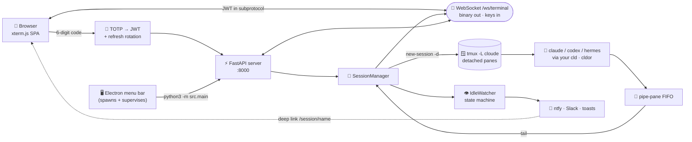

---

## Install

### Before you start — three things that will bite you

**1. You must define a `cld` function in your `~/.zshrc`.** This is not optional and it is the single most common install failure.

For `agent_type == "claude"`, the launch command defaults to `zsh -c 'source ~/.zshrc >/dev/null 2>&1; cld'`. Set `agents.claude_command` in `config.json` to override it with a plain invocation on machines that don't define `cld`/`cldor` (see Configuration below). The environment variable `CLAUDE_CLI_PATH` remains unused for Claude sessions either way. Without a `cld` function or an `agents.claude_command` override, every Claude session dies on arrival with `command not found`.

```zsh
# ~/.zshrc — minimum viable definition
cld() { claude "$@"; }

# Only needed if you use the OpenRouter option in the provider selector.
# It receives the model id as its first argument.
cldor() { local m="$1"; shift; claude --model "$m" "$@"; }
```

Three rules for these:

- **Make it a function, not an alias.** Aliases are resolved at parse time and will not be available to the command string the server runs.
- **It must exec the agent in the foreground.** The tmux pane *is* the session; if your function backgrounds or daemonizes, there's nothing to stream.
- **Put credential lookups inside the function.** That is the entire reason this indirection exists — your API key or OAuth token resolves inside the spawned pane, and Cloude Code never sees it. The author's own functions pull from macOS Keychain entries (`claude-cld-oauth`, `claude-cldor-openrouter`); yours can do whatever you want, as long as it happens in here.

**2. Do not run `./setup.sh`.** It is stale and broken. It hard-exits if `cloudflared` is not installed and then demands a Cloudflare API token, zone ID, and domain — all leftovers from a tunnel subsystem that no longer exists in this codebase. Use the DMG or the manual from-source path below. `setup_auth.py` is current and correct.

**3. macOS only** for the packaged app, Apple Silicon only, macOS 13+. There is no Intel build, no Windows build, and no Linux desktop build. Linux servers are covered by the Docker path.

### Prerequisites

| Requirement | Version | Why |
|---|---|---|
| macOS on Apple Silicon | 13+ | The only DMG built is `arm64` |
| Python | **3.12+** | Hard-enforced by the bootstrapper. No fallback to 3.11 |
| tmux | 3.2+ | `brew install tmux`. Without it you silently drop to the PTY backend and **lose session persistence** |
| Claude Code CLI | current | Installed and logged in on the Mac |
| A `cld` function in `~/.zshrc` | — | Mandatory. See above |
| Node.js | 20+ | Only if building the Electron app from source |
| `gh` CLI | — | Only if you use clone-from-GitHub |

### Path A — DMG (recommended)

```bash
# 1. Download
curl -LO https://github.com/Adoom666/CloudeCode/releases/download/v0.8.1/Cloude.Code-0.8.1-arm64.dmg

# 2. Verify
shasum -a 256 Cloude.Code-0.8.1-arm64.dmg
# expected: 00f1beb6af6176ce904d3df472d5d6e37b4400736b2e04255cf72dcbcc89cfa5
```

3. Open the DMG, drag **Cloude Code** to `/Applications`, and launch it. The first run provisions the venv, installs dependencies, generates your secrets, and pops a QR window — scan it with your authenticator app.
4. From the tray: **Bind IP → your LAN address**, then **Copy URL**. Open that URL on your phone and enter the 6-digit code.

The DMG is code-signed but **not notarized**, so Gatekeeper will warn on first open.

**Two files, two jobs, and neither one has a default.** `config.json` holds
projects, agents, notifications and slash commands; `.env` holds the machine
paths and the secrets. Skipping either is a hard startup failure with a
specific message, not a silent degrade:

| Missing | What you get |
|---|---|
| `config.json` | `FileNotFoundError: Auth config file not found: config.json`, and 26 test errors/failures if you run the suite |
| `DEFAULT_WORKING_DIR` in `.env` | a `CONFIGURATION ERROR` banner naming the field, before the server binds |

`DEFAULT_WORKING_DIR` is deliberately NOT in `config.example.json`. `Settings`
reads it from the environment only (`src/config.py`), so a copy of it in
`config.json` would be inert - a value that looks authoritative, is read by
nothing, and disagrees with the real one the moment either changes. One home
per setting.

### Path B — From source

```bash
git clone https://github.com/Adoom666/CloudeCode.git cloudecode
cd cloudecode

python3 -m venv venv
source venv/bin/activate
pip install -r requirements.txt

cp config.example.json config.json   # projects, agents, notifications
cp .env.example .env                 # then set DEFAULT_WORKING_DIR and LOG_DIRECTORY

python3 setup_auth.py     # generates TOTP + JWT secrets, prints a QR, optional push setup
./start.sh                # python3 -m src.main, binds 0.0.0.0:8000
```

Then open `http://<your-mac-lan-ip>:8000`. To run the Electron menu-bar app in dev mode:

```bash
cd macOS && npm install && npm start
```

To build the DMG yourself: `cd macOS && npm run package`.

### Path C — Docker (Linux / headless)

```bash
cp .env.example .env
bash scripts/preflight-bind-ip.sh          # lists live interfaces
# set CLOUDE_BIND_IP in .env (default 127.0.0.1 = loopback only)
UID=$(id -u) GID=$(id -g) docker compose build
docker compose up -d
docker exec -it cloude-cloude-1 python3 setup_auth.py
```

Docker mode cannot use a Claude Pro/Max subscription — the macOS Keychain isn't reachable from a Linux container, so you need a direct `ANTHROPIC_API_KEY`. macOS-native MCP servers (Shortcuts, AppleScript, Calendar, Messages) don't work there either. See [`docs/deployment-docker.md`](docs/deployment-docker.md).

### Getting to it from outside your LAN

Cloude Code binds to the interface you pick and stops there. It ships no tunnel. For off-LAN access, put it behind Tailscale, UniFi Teleport, a VPN, or your own reverse proxy.

---

## Upgrading and rolling back

Two scripts, `scripts/upgrade.sh` and `scripts/rollback.sh`, move a Path B (from-source) install between release tags. This section is in the root README rather than a separate `docs/` file because upgrading is something you do to the same checkout Install/Configuration/Security already describe, and every fact those scripts depend on (`.env`, `config.json`, `CLOUDE_STATE_DIR`, `config_version`, port 8000) is defined a few sections up. Splitting it out would mean either duplicating that context or forcing you to jump between two files mid-upgrade.

**This covers Path B only.** The packaged `.app` has no in-place upgrader (see Honest limits) - a new version means downloading a new DMG and dragging it over the old one in `/Applications`. What these scripts DO share with the packaged app is everything under the hood: the same version resolver (`src/core/version.py`), the same config migration (`src/core/config_migration.py`), and the same release-tag self-check the app itself runs in the background and reports at `GET /api/v1/version` (TOTP-gated; the home bottom bar's version chip and the server-status panel both read it). If that self-check reports `update_available`, it names the tag and prints the exact command to run.

### Everything is pinned to a release tag

There is no "upgrade to whatever's newest on the branch." `scripts/upgrade.sh` only moves to a tag that is a real, published release tag on the remote (checked with `git ls-remote`, the same call the in-app self-check makes), and it refuses a tag that does not exist there. Given no tag, it resolves the newest one itself. This is the "idiot-proof" requirement: you cannot typo your way onto an untagged commit, and you cannot silently drift onto whatever HEAD happens to be.

### Upgrading

```bash
cd cloudecode                 # your Path B checkout
./scripts/upgrade.sh          # upgrades to the latest release tag
./scripts/upgrade.sh 0.9.0    # upgrades to a specific tag
./scripts/upgrade.sh 0.9.0 --yes    # non-interactive (no confirmation prompt)
```

What it does, in order: resolves the version you are currently on and refuses to continue if it cannot (see "when it refuses" below); resolves the target tag and confirms it is a real release tag; if you are already on that tag, it stops there and changes nothing; otherwise it takes a full backup of your user state and prints the backup's path before touching anything; shows you exactly what it is about to do and asks you to confirm (unless `--yes`); stops the server; runs `git fetch --tags` then `git checkout tags/<tag>`; installs that tag's `requirements.txt`; runs the config migration; restarts the server; and then verifies the server actually answers on `/health` and reports the version you just asked for. A verification failure is reported as a failure, with the exact rollback command to run - never as a quiet warning.

Running the same command twice in a row is safe: the second run sees you are already on the target tag and does nothing further (no second backup, no restart).

### Rolling back

```bash
./scripts/rollback.sh 0.8.1               # go back to a specific version
./scripts/rollback.sh 0.8.1 --yes          # non-interactive
./scripts/rollback.sh 0.8.1 --code-only    # move CODE only, accept the mismatch
```

**Rollback moves CODE and DATA together, and that is the default.** Rolling back only the code leaves the old app looking at a newer `cloude.db`: it refuses to write and drops to degraded read-only, which is the safe failure rather than data loss, but it is not a working install. So `rollback.sh` reads `migration_trail.jsonl`, works out which schema and config versions were in force when this install was at the target release, and restores `cloude.db` and `config.json` to that point from the backups the trail names.

The version is read off the last data entry that STARTED before the target release's `code` entry. The BACKUP is a different entry: backups are taken before a step runs, so the snapshot of version N hangs off the step that moved AWAY from N. Restoring the backup attached to the entry that named the version would put you one version too far back.

It always RESTORES (copy back the backup taken at that version) and never REVERSEs (apply a step's own recorded undo). REVERSE keeps rows RESTORE discards, but its correctness depends on a human having written a complete reversal for that step, and an unattended script must not take the path that rests on a hand-maintained claim.

Before it overwrites anything it prints exactly what it is about to restore, from which backup, taken when, generated from the trail entry itself rather than from a fixed sentence, and says that it cannot be undone. It does still write a `<artifact>.prerestore-<timestamp>` snapshot of what is about to be destroyed. The script will never read that snapshot back; it is there so you can.

`--code-only` skips the data half. It is the opt-out, not the default, and it prints the resulting code/schema mismatch loudly, naming both numbers, because that mismatch is the whole failure this behaviour exists to prevent.

Rollback also checks out the older code AND restores the install-directory backup that was captured right before you left that version, because config migrations only ever move forward. Older code reading a config.json that a newer migration wrote is not a state anyone tested. The rollback target must have a matching backup or the script refuses outright - see below.

### Where backups live

Every upgrade writes a fresh, timestamped backup into `.upgrade-backups/` inside the checkout, before it changes anything. The directory name records both versions, for example `.upgrade-backups/20260817T235913Z_from-0.8.1_to-0.9.0`. Inside it, `install/` holds `.env` and `config.json` (and `config.json.bak` / `.update-check.json` when present), and `state/` holds whatever was found under the state directory at the time: `refresh_tokens.db`, `session_metadata.json`, and, when they have been created yet, `pinned_themes.json` and `unread_state.json`. A file `.manifest` inside the backup records, for every one of those names, exactly one of three outcomes: backed up, legitimately not present yet (a feature you have not used yet, like pinning a theme), or - if that ever happens - refuses to finish rather than pretend the backup is complete. The state directory defaults to `~/Library/Application Support/CloudeCode` (override with `CLOUDE_STATE_DIR`); if you are upgrading an install from before this directory existed, its data is still under the old `LOG_DIRECTORY` path from `.env.example` (`/tmp/cloude-code-logs` by default, which macOS clears on reboot) - set `CLOUDE_STATE_DIR` to that old path before running `scripts/upgrade.sh` so the backup actually finds it, rather than the install directory alone.

Nothing is ever deleted from `.upgrade-backups/`. Prune it by hand if it grows large; the scripts only ever add to it.

### When it refuses

Both scripts follow one rule: if a check cannot be completed, they say so and stop, rather than guessing. Concretely:

- **"could not determine the current version"** - `upgrade.sh` will not move a version it cannot name. This can happen on a checkout with no `.git`, or one that is not itself a git work tree root (see `src/core/version.py`'s resolution order). Fix the checkout, or if this is a brand-new `git clone` that has never been run, there is nothing installed to upgrade yet.
- **"no backup found for version X"** - `rollback.sh` refuses rather than checking out old code next to a config it was never tested against. If you genuinely have a backup somewhere else, pass `--backup-dir`.
- **"the upgrade trail could not be read"** - `migration_trail.jsonl` has a bad line somewhere other than the very last one. `rollback.sh` stops before stopping the server, before checking anything out, and before copying anything. It will NOT fall back to the newest backup: a rollback that guesses which backup to write over your live database is worse than no rollback. Repair or move the trail file and re-run, or pass `--code-only` to move code alone and accept the mismatch.
- **"no backup was ever taken AT vN"** - the trail knows which version belonged to the target release, but that version only ever existed inside a multi-step migration run, which takes one backup at its start. There is no snapshot of the version you are asking for, so it refuses rather than restoring a neighbouring one.
- **"the trail records no code entry arriving at X"** - only `upgrade.sh` and `rollback.sh` write `kind='code'` entries, and only since this feature landed. An install whose trail predates them has no anchor for the data question, so the data half refuses. The code half is still available with `--code-only`.
- **an unverified backup** - `backup_verified` is 0 or missing on the entry that names the backup. A backup that could not be verified is treated as a backup that does not exist, so it refuses rather than restoring bytes nobody checked.
- **"the server did not answer .../health"** or **"reports version X, expected Y"** - the upgrade or rollback ran, but the server did not come back the way it should have. This is reported as a failure with a non-zero exit, and for an upgrade it prints the exact `./scripts/rollback.sh <previous version>` command to recover with.
- **"could not reach \<remote\> to verify the tag exists"** - this is a third, separate outcome from "the tag does not exist." A network problem or an unreachable remote is not the same as a bad tag, and the script says which one happened rather than guessing.
- **"tracked files have local modifications"** - both scripts refuse to run `git checkout` over a dirty tree. Commit or discard the changes first.

None of these leave the install half-changed silently. If a step fails partway (for example, a copy during restore), the message says exactly that and tells you which command to run to inspect or finish the job by hand.

### The unidentified-developer prompt (packaged app only)

The DMG is code-signed but not notarized (see Honest limits and `.github/workflows/release.yml`), so the first time you open a new version of the app, macOS Gatekeeper shows "Cloude Code cannot be opened because it is from an unidentified developer." **Right-click the app and choose Open** - that one-time step clears it, and you will not see it again for that build. `xattr -dr com.apple.quarantine` also works from Terminal if you prefer. This is expected and is not a sign anything is broken.

### Future: a state database, not yet built

A single SQLite database at `~/Library/Application Support/CloudeCode/cloude.db` is planned to eventually hold projects, sessions, adoption state, pinned themes, and unread state in one place instead of the scattered JSON files described above. **This is a note for whoever adds it, not a description of anything that exists today.** When it lands, `scripts/upgrade.sh`'s backup step must be extended to include it, and it must be copied with SQLite's own backup API or `VACUUM INTO`, never a plain file copy (`cp`) - a WAL-mode database copied mid-write with `cp` can produce a file that opens without error and is silently missing the most recent transactions. That failure mode looks identical to a clean backup until someone tries to restore it.

---

## Configuration

### Environment variables (`.env`)

| Name | Default | What it does |
|---|---|---|
| `HOST` | `0.0.0.0` | Interface uvicorn binds to |
| `PORT` | `8000` | Server port. HTTP and WebSocket share it |
| `DEFAULT_WORKING_DIR` | *required* | Root directory new project sessions are created under |
| `CLOUDE_STATE_DIR` | `~/Library/Application Support/CloudeCode` | State directory: session metadata, refresh-token DB, tmux pipe files, logs, and (once it lands) `cloude.db`. The server refuses to start if this cannot be created - it never falls back to a temp directory |
| `LOG_DIRECTORY` | unset | LEGACY, superseded by `CLOUDE_STATE_DIR`. Only relevant to an install upgrading from before `CLOUDE_STATE_DIR` existed: if set, `session_metadata.json` / `pinned_themes.json` / `unread_state.json` are read from here whenever the new location does not have them yet. Never the write target |
| `TOTP_SECRET` | *required* | Your TOTP shared secret. Generated by `setup_auth.py` or the Electron bootstrap |
| `JWT_SECRET` | *required* | JWT signing key. Same generators |
| `AUTH_CONFIG_FILE` | `./config.json` | Path to the non-secret runtime config |
| `ALLOWED_ORIGINS` | computed | CORS override. Left alone it derives from host/port and can never be `*` |
| `LOG_BUFFER_SIZE` | `1000` | In-memory log-line cap per session |
| `LOG_FILE_RETENTION` | `7` | Days of log retention |
| `CLOUDE_APP_VERSION` | unset | Injected by Electron so the UI shows the real app version |
| `CLOUDE_USER_THEMES_DIR` | `~/Library/Application Support/cloude-code-menubar/themes` | Where custom themes are discovered |
| `CLOUDE_ALLOW_QR_REPAIR` | unset | Set to `1` and restart to re-open `/auth/qr` after pairing |
| `CLOUDE_BIND_IP` | `127.0.0.1` | Docker only — which host IP the container publishes on |
| `CLOUDE_PROJECT_PATH` | `./projects` | Docker only — host path mounted at `/workspace` |
| `CLOUDE_LOG_DIR` | `./logs` | Docker only — host path for logs and state |

`CLAUDE_CLI_PATH` is unused by session launch; to point the `claude` agent type at a plain binary, set `agents.claude_command` in `config.json` instead (see below). `API_KEY` is legacy and ignored by the current auth and launch paths. `SESSION_TIMEOUT` appears in `.env.example` but no enforcement of it was found in the code — treat it as inert.

### `config.json` (non-secret runtime config)

| Block | Key | Default | What it does |
|---|---|---|---|
| `session` | `backend` | `auto` | `auto` \| `tmux` \| `pty`. Auto degrades to PTY if tmux is missing |
| | `tmux_socket_name` | `cloude` | The dedicated `tmux -L` socket name |
| | `scrollback_lines` | `3000` | How much history is replayed on rejoin |
| auth | `access_token_ttl_seconds` | `14400` (4h) | Access-token lifetime |
| | `refresh_token_ttl_seconds` | `604800` (7d) | Refresh-token lifetime |
| `auth_rate_limits` | `totp_verify_per_minute` | `5` | Login attempts per minute per IP |
| | `totp_verify_per_hour` | `20` | Login attempts per hour per IP |
| | `trust_proxy_headers` | `false` | Only enable behind a reverse proxy you control |
| `notifications` | `enabled` | `false` | Master switch for the push pipeline |
| | `ntfy_base_url` | `https://ntfy.sh` | Or your self-hosted ntfy |
| | `ntfy_topic` | `""` | Generated by `setup_auth.py`. Rotate with `--rotate-topic` |
| | `public_base_url` | `""` | Base URL used to build tap-through deep links |
| | `idle_threshold_seconds` | `30.0` | Silence before a session counts as "task complete" |
| | `rate_limit_global_cap` | `10` | Max notifications per window |
| | `rate_limit_window_seconds` | `60.0` | The window |
| | `rate_limit_per_kind_cooldown_seconds` | `10.0` | Per-event-type cooldown |
| | `slack_webhook_url` | `""` | Optional Slack incoming webhook |
| | `disable_claude_hooks` | unset | Skip the `~/.claude/settings.json` hook merge |
| `agents` | `claude_command` | `""` | Shell command for `agent_type=claude`. Empty falls back to the `cld`/`cldor` zsh functions (see "Before you start" above) |
| | `codex_command` | `codex` | Command for `agent_type=codex` |
| | `hermes_command` | `hermes` | Command for `agent_type=hermes` |
| | `openclaw_command` | `openclaw tui` | Command for `agent_type=openclaw` |
| | `shell_command` | `$SHELL -i` | The bare-console agent type |
| | `wrappers[]` | `[]` | User-defined launch wrappers for the claude family — see "Launch wrappers" below. Empty means "not configured": resolution falls through to `claude_command`, then the `cld`/`cldor` fallback, unchanged |
| top level | `config_version` | `0` | Migration bookkeeping (see "Launch wrappers" / rollback below). Absent = pre-wrappers config, treated as `0` |
| `uploads` | `enabled` | `true` | Image paste and attach on or off |
| | `ttl_seconds` | `86400` | How long uploaded images survive before sweeping |
| | `max_size_mb` | `10` | Per-upload size cap |
| `providers` | `models[]` | `[]` | Saved OpenRouter model ids for the provider selector |
| top level | `common_slash_commands[]` | — | The quick grid shown above the full slash palette |
| top level | `projects[]` | — | Registered projects: name, path, description, agent type |

Every block is optional and fails soft to defaults with a warning log if malformed.

### Launch wrappers

`agents.wrappers` replaces a single hardcoded `claude_command` with as many
named, user-editable launch commands as you want — pick one per session (the
settings panel's "launch wrappers" section), or set a default. A wrapper's
`script` can be a single command or a full multi-line shell function
definition pasted verbatim (paste the whole thing, indentation and all — the
settings-panel editor preserves it exactly). If `script` *defines* a
function rather than being directly runnable, set `entry` to the function
name to call it after sourcing.

Never paste a secret into a wrapper's `script` or `description`. Read
credentials from the macOS Keychain at run time inside the script instead —
the pattern the built-in `cld`/`cldor` examples both use
(`security find-generic-password ...`). This app never sees the value
either way.

**Upgrading an existing install**: on first boot after upgrading, a one-shot,
idempotent migration (`src/core/config_migration.py`) runs automatically. It
NEVER touches `claude_command`/`codex_command`/`hermes_command`/
`openclaw_command` — those keep working forever, migrated or not. If you
already had a non-empty `claude_command` set, migration stamps
`config_version` and leaves everything else alone (no wrappers get seeded on
top of your existing choice). Otherwise it probes whether `cld` / `cldor`
actually resolve in your shell (`zsh -ic 'type cld'`) and, only if so, seeds
thin wrapper entries that forward to them — your existing `~/.zshrc`
functions become selectable wrappers instead of a hidden fallback. Nothing
is guessed: a function that doesn't resolve is never seeded.

**Rolling back**: the migration backs up `config.json` to `config.json.bak`
(the pre-write bytes, one generation) before it writes anything. To undo:

```bash
cp config.json.bak config.json   # restores the exact pre-migration file
```

That's a config-level rollback — the legacy fallback keys were never
modified, so resolution behavior returns to exactly what it was before you
upgraded. If you need a code-level rollback too, `baseline/adoom-2026-08-14`
(commit `6392124`) tags the last commit before the wrappers feature existed:

```bash
git checkout baseline/adoom-2026-08-14 -- src/
```

### CLI

```bash
python3 setup_auth.py --rotate-topic   # regenerate the push topic without a full re-setup
./nuke.sh                              # full teardown, asks you to type NUKE
./nuke.sh --dry-run                    # print every target, delete nothing
./nuke.sh --skip-confirm               # non-interactive full teardown
```

#### What `nuke.sh` removes, and how to rehearse it

It removes `.env`, `config.json`, `venv/`, the log and projects directories,
the `/tmp` artifacts, the LaunchAgent, the Electron app-support directory,
and **the state directory** - `cloude.db`, `refresh_tokens.db` and
`migration_trail.jsonl`. That last one is resolved by calling
`resolve_state_dir()`, the same shell mirror of `Settings.get_state_dir()`
that `upgrade.sh` uses, so `CLOUDE_STATE_DIR` is honoured and no path is
restated in shell. If the path cannot be resolved the script exits non-zero
having deleted nothing, rather than skipping a target it could not find.

It does **not** kill the tmux server. A socket is keyed on (user, socket
name) and carries no record of which checkout started a session, so sessions
on it cannot be attributed to this install. The script names the socket and
prints the exact `kill-server` command instead. `CLOUDE_NUKE_KILL_TMUX=true`
opts in.

Every destructive target is redirectable, which is what makes
`tests/test_nuke_sandbox.py` able to run the real script end to end against a
temp directory: `CLOUDE_NUKE_HOME`, `CLOUDE_NUKE_TMP_DIR`,
`CLOUDE_NUKE_LAUNCHCTL`, `CLOUDE_NUKE_PGREP_PATTERN` (empty disables the
machine-wide process match), `CLOUDE_NUKE_TMUX_BIN`,
`CLOUDE_NUKE_TMUX_SOCKET`, `CLOUDE_NUKE_KILL_TMUX`, `CLOUDE_NUKE_DRY_RUN`.
Each defaults to the real production value, so plain `./nuke.sh` behaves
exactly as documented above.

---

## Security model

The remote surface is a web server on your LAN that can start processes on your Mac. Here's exactly what protects it.

**Getting in.** There is no password, because there's nothing to leak. Login is a 6-digit TOTP code from any RFC 6238 authenticator, with ±30s drift tolerance, rate-limited to 5 attempts per minute and 20 per hour. A code you just used is cached for 90 seconds behind an async lock, so someone who sniffs it can't replay it inside its own validity window. Pairing is one-shot: after your first successful login, `/auth/qr` refuses to hand out the TOTP secret again, so a LAN neighbor can't pair their own authenticator.

**Staying in.** A successful login mints two tokens: a **4-hour access JWT** and a **7-day refresh JWT**. The access lifetime is long on purpose — closing your laptop shouldn't cost you an OTP. The refresh token is where the real defense lives. It's tracked in SQLite and rotated on every use, so if an old one is ever replayed, the server treats it as theft: it burns the entire token chain and forces a fresh TOTP. The attacker gets logged out, and so do you — which is how you find out.

**Token handling.** The signing algorithm is pinned to HS256, closing the `alg:none` bypass, and a `typ` claim stops a refresh token from being presented as an access token. WebSocket auth travels in the `Sec-WebSocket-Protocol` handshake header rather than a `?token=` query string, so your JWT never lands in a proxy access log.

**Your Claude credentials.** They never enter this application. Sessions launch through *your own* `cld` / `cldor` zsh function, which means the credential lookup happens inside the spawned tmux pane. Cloude Code has no code path that reads, stores, or forwards an OAuth token or API key.

**The rest of the surface.** CORS origins are computed from your host and port, and because the middleware runs with credentials, `"*"` is structurally impossible. Every response carries `default-src 'self'`, `frame-ancestors 'none'`, nosniff, and no-referrer. Claude Code's own lifecycle hooks post to a loopback-only endpoint that additionally requires a per-session random HMAC bearer token compared in constant time. Uploads pass an extension allowlist, a PIL structural verify, a magic-byte cross-check, and a size cap, then land `0600` inside a `0700` directory and get TTL-swept. Session names containing tmux's `:` or `.` target separators are refused before they can reach a `-t` argument. OpenRouter model ids are regex-validated and double-`shlex.quote`d across both shell layers.

**What this is not.** There is no TLS in-process — it speaks plain HTTP and WS. If you want encryption, terminate it at a proxy in front. The threat model is a trusted LAN with hardened defaults, not a service designed to sit naked on the public internet. One practical consequence of plain HTTP: on a non-localhost origin, browsers disable the Clipboard API, so the 📎 menu degrades to a "use Cmd+V" hint.

---

## Honest limits

**Reachability**

- **No tunnel.** Cloude Code has no Cloudflare, ngrok, or Tailscale integration. It binds to the interface you choose. Off-LAN access is your own VPN, Tailscale, Teleport, or reverse proxy.
- **No TLS in-process.** Plain HTTP and WS. Terminate encryption at a proxy if you need it.
- **LAN-only threat model.** Hardened defaults, but not built to face the open internet.

**Platform**

- **macOS 13+ on Apple Silicon** for the packaged app. One DMG target, arm64. No Intel, Windows, or Linux desktop build.
- **Code-signed but not notarized.** Gatekeeper warns on first open.
- **No auto-update, no Homebrew cask, no npm package.** Upgrades mean downloading a new DMG.
- **Python 3.12+ is hard-required.** No fallback to 3.11.

**Client**

- **Not a PWA.** No manifest, no service worker, not installable, no offline mode.
- **No voice input.** The `/voice` entry in the slash palette is reference text describing a Claude Code CLI command. This client implements no dictation or speech recognition.
- **No file browser, no diff viewer, no image preview.** The folder picker is a directory chooser for launching a project, nothing more. Pasted images are written to disk as a path and never rendered in the browser.
- **No QR pairing in the browser.** Pairing happens in the Electron app or via `setup_auth.py` on the server.
- **No automatic dark mode.** No `prefers-color-scheme` support — theming is 23 named themes, chosen manually.
- **No iOS safe-area handling.** No notch/home-indicator insets in the CSS.
- **HEIC/HEIF uploads are rejected** with a "convert to PNG/JPEG" message.
- **No client-side framework, bundler, or tests.** Vanilla JS by design. The test suite (21 pytest files) covers the Python server only.

**Behavior**

- **Without tmux, sessions die with the server.** The PTY fallback works but has no persistence and no scrollback.
- **Docker mode can't use a Claude Pro/Max subscription.** You need a direct API key.
- **`./setup.sh` is broken.** It hard-fails without `cloudflared` and prompts for Cloudflare credentials it no longer needs. Use the DMG or the manual from-source path.
- **Vestigial tunnel UI in the tray.** The menu still shows a `Tunnels: N` line that permanently reads 0, and the teardown dialog still mentions Cloudflare DNS records. Cosmetic dead wiring from the removed subsystem.
- **`cloudflare` and `pyyaml` are still in `requirements.txt`** and wired to nothing. Stale dependencies.
- **No CI.** `.github/workflows/` contains Claude review bots, not a build or test pipeline. Releases are uploaded by hand.

---

## Changelog

**v0.8.1** — 2026-08-04

- Clicking a project always spawns a new session, enabling multiple concurrent Claude sessions in one directory.
- 📎 clipboard menu: paste text or an image from the OS clipboard into the terminal.
- Real terminal text selection and copy — Cmd+C / Ctrl+Shift+C on desktop, long-press-drag with a floating copy button on iOS.
- iOS viewport anchoring so floating menus stop getting clipped off-screen.

**v0.8.0** — 2026-08-04

- Provider-selector modal on every launch path: pinned "Claude" or any saved OpenRouter model, with in-app add and remove.
- Model IDs hardened against shell injection through the full two-shell chain.

**v0.7.5** — 2026-06-26

- Folder picker gains type-ahead, an editable path bar, and auto-`mkdir -p` for paths that don't exist yet.

**v0.7.4** — 2026-06-23

- Fixed the `/clear`-on-rejoin context-wipe bug. Two Ctrl+L bytes arriving within two seconds used to trigger Claude Code's own clear chord and silently wipe the conversation — in an app whose entire purpose is preserving your session.

**v0.7.3** — 2026-05-25

- Access-token TTL raised from 15 minutes to 4 hours. No more re-entering an OTP every time the laptop wakes.

Full history: [releases](https://github.com/Adoom666/CloudeCode/releases) · 14 tags, 235 commits since 2025-10-27.

---

## Contributing

Issues and pull requests are welcome at [Adoom666/CloudeCode](https://github.com/Adoom666/CloudeCode).

Before opening a PR:

- Run the Python test suite: `source venv/bin/activate && python3 -m pytest`
- Keep the client dependency-free. It's vanilla JS with no bundler on purpose.
- If you touch session lifecycle, respect the invariant: **detach, never destroy.** Only an explicit kill may end a tmux session.

Good first targets, all documented above: repairing `./setup.sh`, removing the vestigial tunnel UI from the tray, and dropping the stale `cloudflare` and `pyyaml` dependencies.

---

## License

MIT © 2025 Adoom666. See [LICENSE](LICENSE).

<div align="center">
<br>
<b>Your Mac keeps coding. You keep the remote.</b>
</div>
