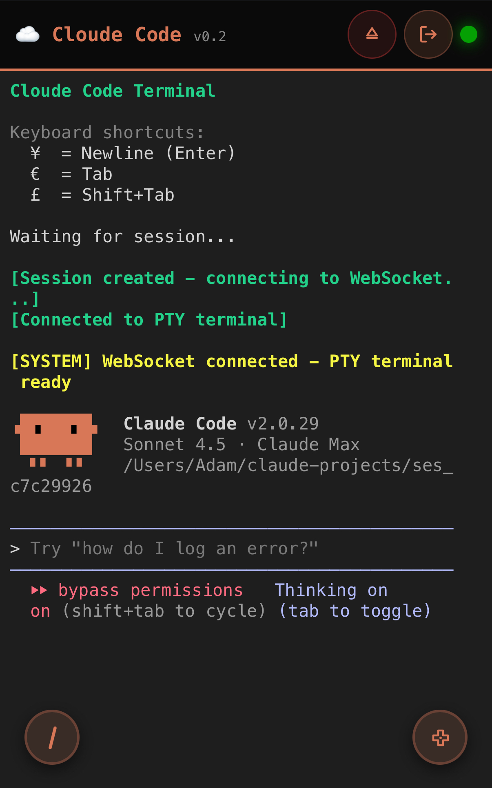

# Cloude Code

Remote control platform for Claude Code CLI sessions — access your terminal from anywhere via secure Cloudflare tunnels.

[](https://www.youtube.com/shorts/tGcRtH_RLiE)

> **Quick Demo:** Watch Cloude Code in action — mobile control, auto-tunneling, and real-time terminal streaming.

---

## Overview

Cloude Code is a hybrid desktop application that runs the Claude Code CLI in a persistent pseudo-terminal (PTY) on your Mac and exposes a web-based control interface over the internet. A macOS menu bar app (Electron) manages a Python FastAPI server, which spawns PTY sessions and streams terminal I/O to browser clients via WebSocket. When Claude spins up a dev server, Cloude Code automatically creates a Cloudflare tunnel and broadcasts the public URL to all connected clients.

The platform was built for mobile-first developer workflows: start Claude Code on your Mac, continue the session from your phone on the couch, a tablet in another room, or a laptop on the road. Authentication is handled via TOTP (Google Authenticator / Authy) plus short-lived JWTs. Tunneling supports both zero-config "quick" tunnels (random `*.trycloudflare.com` URLs) and named tunnels with persistent custom domains.

Under the hood, Cloude Code combines a Node/Electron control plane (tray icon, server lifecycle, auto-launch) with a Python data plane (PTY management, tunnel orchestration, auth). The web frontend is vanilla JS with xterm.js for terminal emulation — deliberately dependency-light so it loads fast on mobile networks.



---

## Features

- **Remote terminal control** — Full xterm.js emulation with ANSI/Unicode support, bidirectional streaming over WebSocket
- **Persistent PTY sessions** — Claude Code runs in an isolated pseudo-terminal that survives server restarts; metadata in `LOG_DIRECTORY/session_metadata.json`
- **Automatic dev-server tunneling** — Pattern detection watches terminal output for `localhost:PORT` and triggers Cloudflare tunnel creation
- **Hybrid tunnel strategy** — Quick tunnels (instant, random URLs) or named tunnels (persistent custom domains, auto-created CNAMEs)
- **TOTP + JWT authentication** — 2FA via any RFC 6238 authenticator app, `±1` window drift tolerance, configurable JWT lifetime
- **Project launcher** — MRU-sorted project list with optional template file copying for new projects
- **Slash-command palette** — One-click insertion of all Claude Code slash commands (`/agents`, `/clear`, `/mcp`, etc.)
- **macOS menu bar integration** — Status indicator, server start/stop, launch-at-login via LaunchAgent
- **Mobile-optimized UI** — D-pad overlay for arrow/Ctrl keys, special key bindings (`¥`=Enter, `€`=Tab), responsive layout
- **Smart auto-scroll** — Follows output but disables when you scroll up to read history
- **WebSocket resilience** — Auto-reconnect with exponential backoff, 30s keepalive, session conflict resolution

---

## Architecture

### Data flow

```
 ┌─────────────────────────────────────────────────────────────────────┐
 │                        REMOTE / MOBILE CLIENT                        │
 │   Browser + xterm.js  ·  TOTP login  ·  Launchpad  ·  D-pad          │
 └───────────────────────────────┬─────────────────────────────────────┘
                                 │  HTTPS + WSS (Bearer JWT)
                                 ▼
 ┌─────────────────────────────────────────────────────────────────────┐
 │                     CLOUDFLARE EDGE (Tunnel)                         │
 │    Quick Tunnel:  *.trycloudflare.com                                │
 │    Named Tunnel:  *.yourdomain.com                                   │
 └───────────────────────────────┬─────────────────────────────────────┘
                                 │  cloudflared --> localhost:8000
                                 ▼
 ┌─────────────────────────────────────────────────────────────────────┐
 │              MACOS HOST  (Electron menu bar app)                     │
 │                                                                      │
 │   ┌─────────────────────┐       ┌──────────────────────────────┐    │
 │   │  Electron main.js   │ spawn │   Python FastAPI (uvicorn)   │    │
 │   │  · Tray icon        │◄─────►│   · /api/v1/*  REST          │    │
 │   │  · server-manager   │ health│   · /ws/terminal  WebSocket  │    │
 │   │  · launchagent      │ poll  │   · /health                  │    │
 │   └─────────────────────┘ 5s    └──────────┬───────────────────┘    │
 │                                             │                        │
 │                                             ▼                        │
 │   ┌─────────────────────────────────────────────────────────────┐   │
 │   │                    SESSION + TUNNEL CORE                     │   │
 │   │                                                              │   │
 │   │   SessionManager ──► PTYSession ──► bash + claude CLI        │   │
 │   │        │                  │                                  │   │
 │   │        │                  └──► LogMonitor (pattern detect)   │   │
 │   │        │                              │                      │   │
 │   │        │                              ▼                      │   │
 │   │        └───► AutoTunnelOrchestrator ─► HybridTunnelManager   │   │
 │   │                                              │               │   │
 │   │                                              ▼               │   │
 │   │                                     cloudflared subprocess   │   │
 │   │                                     + Cloudflare API         │   │
 │   └─────────────────────────────────────────────────────────────┘   │
 └─────────────────────────────────────────────────────────────────────┘
```

### Control plane vs. data plane

- **Control plane (Electron):** The menu bar app owns server lifecycle. It spawns the Python process via Node `child_process`, polls `GET /health` every 5s (2s during startup), and — critically — adopts an existing process on port 8000 if one is already running. This makes reboots and crashes graceful.
- **Data plane (Python):** FastAPI handles all session, tunnel, auth, and WebSocket traffic. `SessionManager` creates `PTYSession` objects that wrap Python's `pty` module. `LogMonitor` tees the PTY output and scans for port-exposing patterns. When a match fires, `AutoTunnelOrchestrator` asks `HybridTunnelManager` to provision a tunnel, and the resulting URL is broadcast to the WebSocket client as a typed event.

### Authentication flow

```
   Client                         Server
     │                              │
     │  GET /api/v1/auth/qr         │   (unauthenticated)
     │─────────────────────────────►│
     │  PNG QR (otpauth://...)      │
     │◄─────────────────────────────│
     │                              │
     │  [user scans QR with app]    │
     │                              │
     │  POST /api/v1/auth/verify    │
     │  { code: "123456" }          │
     │─────────────────────────────►│
     │                              │ pyotp.verify(±1 window)
     │  { token, expires_in }       │ jwt.encode(exp=30m)
     │◄─────────────────────────────│
     │                              │
     │  localStorage.set('claude_tunnel_token', token)
     │                              │
     │  GET /api/v1/sessions        │
     │  Authorization: Bearer <jwt> │
     │─────────────────────────────►│ jwt.decode + exp check
     │  { session }                 │
     │◄─────────────────────────────│
     │                              │
     │  WSS /ws/terminal?token=...  │
     │═════════════════════════════►│
     │  bidirectional PTY stream    │
     │◄════════════════════════════►│
```

---

## File Structure

```
cloudecode/
├── macOS/                              # Electron menu bar app
│   ├── main.js                         # Tray icon, app lifecycle
│   ├── preload.js                      # Secure IPC bridge
│   ├── server-manager.js               # Python subprocess lifecycle
│   ├── launchagent-installer.js        # macOS auto-launch (LaunchAgent plist)
│   ├── package.json                    # Electron + electron-builder config
│   ├── assets/                         # iconTemplate.png, AppIcon-1024.png
│   └── dist/                           # Built DMG packages (generated)
│
├── src/                                # Python FastAPI backend
│   ├── main.py                         # FastAPI app, lifespan, mounts
│   ├── config.py                       # Pydantic settings, env loading
│   ├── models.py                       # Pydantic data models
│   ├── core/
│   │   ├── session_manager.py          # PTY session lifecycle
│   │   ├── pty_session.py              # PTY spawn + I/O
│   │   ├── log_monitor.py              # Watches PTY for localhost patterns
│   │   ├── auto_tunnel.py              # Orchestrates auto-tunnel creation
│   │   ├── hybrid_tunnel_manager.py    # Quick + named tunnel selector
│   │   ├── tunnel_manager.py           # Base tunnel lifecycle
│   │   ├── named_tunnel_manager.py     # Named tunnel implementation
│   │   └── cloudflare_api.py           # Cloudflare REST API wrapper
│   ├── api/
│   │   ├── routes.py                   # REST: sessions/tunnels/projects
│   │   ├── auth.py                     # TOTP + JWT endpoints
│   │   ├── websocket.py                # PTY WebSocket streaming
│   │   └── deps.py                     # DI utilities (auth, managers)
│   └── utils/                          # PTY helpers, templates, patterns
│
├── client/                             # Web frontend (vanilla JS SPA)
│   ├── index.html                      # Single-page app shell
│   ├── js/
│   │   ├── api.js                      # REST + WebSocket client
│   │   ├── auth.js                     # TOTP login, JWT storage
│   │   ├── terminal.js                 # xterm.js integration
│   │   ├── launchpad.js                # Project selector UI
│   │   ├── slash-commands.js           # Slash command palette
│   │   └── dpad.js                     # Mobile D-pad controls
│   └── css/styles.css                  # Dark theme, responsive
│
├── config.json                         # Projects + slash commands (user-editable)
├── config.example.json                 # Template
├── .env.example                        # Environment variable template
├── requirements.txt                    # Python dependencies
├── setup.sh                            # Full installer (venv + pip + cloudflared)
├── setup_auth.py                       # Interactive TOTP/JWT + CF config wizard
├── nuke.sh                             # Complete uninstall (files + tunnels + DNS)
├── reset.sh                            # Light reset (preserves config)
├── start.sh / stop.sh                  # Manual server control
│
├── IOS_APP_PLAN.md                     # Future native iOS app design
├── THEPROBLEM.md                       # Known issues log
└── SECURITY_GAPS.md                    # Security posture analysis
```

---

## Prerequisites

| Requirement     | Version     | Notes                                                           |
| --------------- | ----------- | --------------------------------------------------------------- |
| macOS           | 11+         | Electron app and menu bar integration target macOS              |
| Python          | 3.8+        | 3.11+ recommended                                               |
| Node.js         | 18+         | Only required to build the Electron app from source             |
| Claude CLI      | Latest      | `claude` must be on `PATH` (or `CLAUDE_CLI_PATH` configured)    |
| cloudflared     | Any recent  | Auto-downloaded by `setup.sh` if missing                        |
| Cloudflare acct | Free tier   | Optional — required for named tunnels only                      |

Quick dependency check:

```bash
python3 --version
which claude
which cloudflared || brew install cloudflared
```

---

## Installation

### End-user (DMG)

1. Download the latest `Cloude Code.dmg` from the releases page (or build from source — see below).
2. Open the DMG and drag **Cloude Code** to `/Applications`.
3. Launch. The first run copies default config files into `~/Library/Application Support/cloude-code-menubar/`.
4. Click the menu bar icon → **Setup** to run the interactive auth wizard (generates TOTP secret and JWT key, prompts for optional Cloudflare credentials).
5. Scan the displayed QR code with Google Authenticator, Authy, or any RFC 6238 TOTP app.
6. Open `http://localhost:8000` in your browser, or use the public tunnel URL shown in the menu.

### Developer (clone + setup)

```bash
# 1. Clone
git clone <repo-url> cloudecode
cd cloudecode

# 2. Run the installer — creates venv, installs deps, downloads cloudflared
./setup.sh

# 3. Run interactive auth setup — generates secrets, writes .env and config.json
python3 setup_auth.py

# 4. Start the Python server
./start.sh

# 5. (Optional) Run the Electron menu bar app in dev mode
cd macOS
npm install
npm start
```

---

## Configuration

### Environment variables (`.env`)

Copy `.env.example` → `.env` before editing. `setup_auth.py` will populate secrets and prompt for optional Cloudflare values.

| Variable                 | Required           | Default          | Purpose                                                       |
| ------------------------ | ------------------ | ---------------- | ------------------------------------------------------------- |
| `HOST`                   | No                 | `0.0.0.0`        | Server bind address (use `127.0.0.1` for localhost-only)      |
| `PORT`                   | No                 | `8000`           | Server port                                                   |
| `DEFAULT_WORKING_DIR`    | **Yes**            | —                | Directory where new project sessions are created              |
| `SESSION_TIMEOUT`        | No                 | `3600`           | Session inactivity timeout (seconds)                          |
| `LOG_DIRECTORY`          | **Yes**            | —                | Log output + `session_metadata.json` location                 |
| `LOG_BUFFER_SIZE`        | No                 | `1000`           | In-memory log line buffer per session                         |
| `LOG_FILE_RETENTION`     | No                 | `7`              | Days to retain on-disk log files                              |
| `CLAUDE_CLI_PATH`        | No                 | auto-detect      | Absolute path to `claude` binary                              |
| `TUNNEL_PROVIDER`        | No                 | `cloudflare`     | Tunnel backend (only `cloudflare` implemented)                |
| `AUTO_CREATE_TUNNELS`    | No                 | `true`           | Automatically tunnel detected dev servers                     |
| `TUNNEL_TIMEOUT`         | No                 | `30`             | Tunnel-creation timeout (seconds)                             |
| `USE_NAMED_TUNNELS`      | No                 | `true`           | Use persistent named tunnels (vs. quick tunnels)              |
| `CLOUDFLARE_API_TOKEN`   | If tunnels used    | —                | Needs `Zone.DNS:Edit` + `Account.Tunnel:Edit` permissions     |
| `CLOUDFLARE_ZONE_ID`     | If tunnels used    | —                | Numeric zone ID for your domain                               |
| `CLOUDFLARE_DOMAIN`      | If named tunnels   | —                | Base domain (e.g. `cloude.example.com`)                       |
| `CLOUDFLARE_TUNNEL_NAME` | No                 | `claude-tunnel`  | Name used for the named tunnel                                |
| `CLOUDFLARE_TUNNEL_ID`   | Auto               | —                | Populated by setup after first run                            |
| `TOTP_SECRET`            | **Yes**            | generated        | Generated by `setup_auth.py` — do not edit manually           |
| `JWT_SECRET`             | **Yes**            | generated        | Generated by `setup_auth.py` — do not edit manually           |
| `API_KEY`                | No                 | —                | Reserved; currently unused                                    |
| `ALLOWED_ORIGINS`        | No                 | `["*"]`          | CORS allowlist as JSON array — see Security Considerations    |
| `AUTH_CONFIG_FILE`       | No                 | `./config.json`  | Path to projects + slash-command config                       |

### `config.json`

User-editable configuration for projects, template copying, and slash commands.

<details>
<summary>Example config.json</summary>

```json
{
  "jwt_expiry_minutes": 30,
  "template_path": "~/my-templates",
  "projects": [
    {
      "name": "my-app",
      "path": "~/projects/my-app",
      "description": "Primary dev project"
    }
  ],
  "common_slash_commands": [
    "/agents", "/clear", "/compact", "/context",
    "/hooks", "/mcp", "/resume", "/rewind", "/usage"
  ]
}
```

</details>

---

## Running

### Development (Python server only)

```bash
source venv/bin/activate
python3 -m src.main
# or
./start.sh
```

Server listens on `http://0.0.0.0:8000`. Open `http://localhost:8000` or `http://<mac-lan-ip>:8000` from a phone on the same network.

### Development (Electron + server)

```bash
cd macOS
npm start          # Launches Electron, which spawns the Python server
```

The menu bar tray icon shows server status. If a Python server is already running on port 8000, Electron will adopt it rather than spawning a duplicate.

### Production (packaged DMG)

Launch **Cloude Code.app** from `/Applications`. The Electron app copies default config to `~/Library/Application Support/cloude-code-menubar/` on first run, spawns the bundled Python server, and surfaces status + controls via the menu bar.

### Shell helpers

| Script      | Purpose                                                                 |
| ----------- | ----------------------------------------------------------------------- |
| `start.sh`  | Activates venv and starts the Python server                             |
| `stop.sh`   | Graceful server shutdown                                                |
| `reset.sh`  | Light reset — stops server, clears session metadata, preserves config   |

---

## API Reference

Base URL: `http://localhost:8000`  ·  API prefix: `/api/v1`

### Unauthenticated endpoints

| Method | Path                        | Body                 | Returns                             |
| ------ | --------------------------- | -------------------- | ----------------------------------- |
| `GET`  | `/health`                   | —                    | `{ status: "ok" }`                  |
| `GET`  | `/api/v1/auth/qr`           | —                    | PNG image (TOTP QR)                 |
| `GET`  | `/api/v1/auth/status`       | —                    | `{ authenticated: bool }`           |
| `POST` | `/api/v1/auth/verify`       | `{ code: "123456" }` | `{ token: string, expires_in: n }`  |

### Authenticated endpoints

All require `Authorization: Bearer <jwt>` header.

| Method   | Path                   | Body                                                                                      | Returns             |
| -------- | ---------------------- | ----------------------------------------------------------------------------------------- | ------------------- |
| `POST`   | `/api/v1/sessions`     | `{ working_dir, auto_start_claude?, copy_templates? }`                                    | `Session` object    |
| `GET`    | `/api/v1/sessions`     | —                                                                                         | `Session` or `null` |
| `DELETE` | `/api/v1/sessions`     | —                                                                                         | `204 No Content`    |
| `GET`    | `/api/v1/tunnels`      | —                                                                                         | `Tunnel[]`          |
| `POST`   | `/api/v1/tunnels`      | `{ port: number }`                                                                        | `Tunnel`            |
| `DELETE` | `/api/v1/tunnels/{p}`  | —                                                                                         | `204`               |
| `GET`    | `/api/v1/projects`     | —                                                                                         | `Project[]`         |
| `POST`   | `/api/v1/projects`     | `{ name, path, description? }`                                                            | `Project`           |
| `DELETE` | `/api/v1/projects/{n}` | —                                                                                         | `204`               |

### WebSocket protocol

**Endpoint:** `ws://localhost:8000/ws/terminal?token=<jwt>` (use `wss://` through tunnels)

<details>
<summary>Message types</summary>

**Server → Client**

```json
{ "type": "pty_data", "data": "<base64>" }
{ "type": "tunnel_created", "tunnel": { "port": 3000, "url": "..." } }
{ "type": "tunnel_destroyed", "port": 3000 }
{ "type": "ping" }
```

**Client → Server**

```json
{ "type": "pty_data", "data": "echo hello\n" }
{ "type": "pty_resize", "cols": 80, "rows": 24 }
{ "type": "pong" }
```

</details>

---

## Authentication

Cloude Code uses a two-stage auth flow: TOTP for human verification, JWT for machine requests.

1. **TOTP bootstrap** — `setup_auth.py` generates a random TOTP secret (RFC 6238, 30-second period, 6-digit codes) and writes it to `.env` as `TOTP_SECRET`. A QR code is generated via `qrcode` + `Pillow` and saved to `totp-qr.png`. Scan this with Google Authenticator, Authy, 1Password, or any compatible app.

2. **Verification** — Client calls `POST /api/v1/auth/verify` with the current 6-digit code. Server calls `pyotp.TOTP(secret).verify(code, valid_window=1)`, which accepts the code from the previous, current, or next 30-second window (drift tolerance).

3. **JWT issuance** — On successful TOTP, server signs a JWT with `JWT_SECRET` (HS256). Lifetime defaults to 30 minutes (configurable via `jwt_expiry_minutes` in `config.json`). Token payload contains `exp` claim only.

4. **Session requests** — Client stores the JWT in `localStorage['claude_tunnel_token']` and sends `Authorization: Bearer <jwt>` on every REST call. WebSocket connections pass the token as a `?token=` query parameter (one-shot check at connection time).

5. **Expiration handling** — On 401 response, the frontend clears the token and re-prompts for TOTP.

> **Note on tunnel-level access:** The Cloudflare tunnel URL itself is public. API routes are protected by TOTP/JWT, but static assets at `/` are served without auth (they just redirect to the login page). Do not rely on URL obscurity as a security boundary.

---

## Tunneling

Cloude Code supports two Cloudflare tunnel modes via `HybridTunnelManager`. Switch between them with `USE_NAMED_TUNNELS` in `.env`.

### Quick tunnels (zero-config)

Uses `trycloudflare.com` — no Cloudflare account required.

- **Pros:** Instant, free, zero configuration
- **Cons:** Random URLs that change on every restart, rate-limited, less stable
- **Use when:** Testing, demos, one-off sharing

### Named tunnels (recommended for regular use)

Persistent tunnel tied to your Cloudflare account, with auto-managed DNS records on your custom domain.

- **Pros:** Stable URLs (`3000.cloude.yourdomain.com`), CNAMEs created/reused automatically, single persistent tunnel multiplexes multiple ports
- **Cons:** Requires free Cloudflare account + initial setup

<details>
<summary>Named tunnel setup steps</summary>

1. `cloudflared login` — opens browser for Cloudflare OAuth
2. Create API token at https://dash.cloudflare.com/profile/api-tokens
   - Permissions needed: `Zone.DNS:Edit` and `Account.Cloudflare Tunnel:Edit`
3. Copy your domain's **Zone ID** from the Cloudflare dashboard overview page
4. Populate `.env`:
   ```bash
   USE_NAMED_TUNNELS=true
   CLOUDFLARE_API_TOKEN=<your_token>
   CLOUDFLARE_ZONE_ID=<your_zone_id>
   CLOUDFLARE_DOMAIN=cloude.yourdomain.com
   CLOUDFLARE_TUNNEL_NAME=cloude-tunnel
   ```
5. Restart the server. The named tunnel is created on first boot; subsequent boots reuse `CLOUDFLARE_TUNNEL_ID` written by setup.

</details>

### Pattern detection

Auto-tunneling fires when `LogMonitor` matches these patterns in PTY output:

| Pattern name          | Matches                                                             | Action         |
| --------------------- | ------------------------------------------------------------------- | -------------- |
| `localhost_server`    | `localhost:PORT`, `127.0.0.1:PORT`, `0.0.0.0:PORT`, `[::]:PORT`     | Create tunnel  |
| `server_ready`        | "server running", "development server started"                      | Create tunnel  |
| `listening_on_port`   | "listening on port 3000", "running on :8080"                        | Create tunnel  |
| `error` / `warning`   | `ERROR`, `FAIL`, `WARN`, etc.                                       | Log event      |
| `build_complete`      | "build successful", "compilation finished"                          | Log event      |

---

## Build & Distribution

### Building the Electron app

```bash
cd macOS
npm install
npm run build        # Produces dist/Cloude Code.dmg
```

`electron-builder` configuration in `macOS/package.json` controls:

- **App ID:** `com.cloudecode.menubar`
- **Bundled assets:** Python source tree, `.env.example`, `client/`, `requirements.txt`
- **Icon:** `assets/AppIcon-1024.png` (app), `assets/iconTemplate.png` (menu bar)
- **Output:** `macOS/dist/Cloude Code.dmg`

### First-run behavior (packaged)

On first launch, `ServerManager.ensureServerFiles()` copies the bundled Python tree and `.env.example` into `~/Library/Application Support/cloude-code-menubar/`. User-edited config survives app updates; bundled defaults are only copied if the target file does not exist.

---

## Scripts Reference

| Script           | Invocation              | What it does                                                                                                                |
| ---------------- | ----------------------- | --------------------------------------------------------------------------------------------------------------------------- |
| `setup.sh`       | `./setup.sh`            | Full installer: creates venv, installs `requirements.txt`, downloads `cloudflared` if missing, then invokes `setup_auth.py` |
| `setup_auth.py`  | `python3 setup_auth.py` | Interactive wizard: generates `TOTP_SECRET` + `JWT_SECRET`, prompts for Cloudflare values, writes `.env` + `config.json`, saves `totp-qr.png` |
| `start.sh`       | `./start.sh`            | Activates venv and starts the Python server                                                                                 |
| `stop.sh`        | `./stop.sh`             | Graceful server shutdown                                                                                                    |
| `reset.sh`       | `./reset.sh`            | Light reset — stops server, clears session metadata, preserves `.env` + `config.json`                                       |
| `nuke.sh`        | `./nuke.sh`             | Complete uninstall: deletes `.env`, `config.json`, `venv/`, Cloudflare tunnels, DNS records, logs, and `~/Library/Application Support/cloude-code-menubar/` |

> **Warning:** `nuke.sh` is destructive and deletes Cloudflare DNS records it created. Review before running on a shared account.

---

## Known Issues & Active Patches

| Issue                                                | Cause                                                     | Mitigation                                                                                  | Status           |
| ---------------------------------------------------- | --------------------------------------------------------- | ------------------------------------------------------------------------------------------- | ---------------- |
| Menu bar shows "Stopped" while server is running     | Electron loses subprocess PID reference on reload         | Health poll every 5s; adopts existing process on port 8000 if found                         | Partial fix      |
| `CLOUDFLARE_DOMAIN` stays as placeholder after setup | `setup_auth.py` write timing issue                        | Placeholder detection in server → surfaces "Setup Required" state in UI                     | Workaround       |
| `.env` location differs dev vs. packaged             | Bundled app reads from Application Support                | `ServerManager.ensureServerFiles()` copies `.env.example` to Application Support on boot    | Fixed            |
| Python 3 detection fails on first run                | Varies by install method (brew, system, pyenv)            | Multi-path fallback in server-manager resolves all common install locations                 | Fixed            |
| `ALLOWED_ORIGINS = ["*"]` is too permissive          | Default for ease of setup                                 | Restrict to your tunnel domain in `.env` — see Security Considerations                      | Documented       |
| Stale session metadata survives crash                | Saved PID may no longer be alive after hard kill          | PID liveness check on load; stale entries cleaned up automatically                          | Fixed            |
| `ALLOWED_ORIGINS` pydantic parse error               | Pydantic v2 strict JSON parsing of list env vars          | Pre-parse logic added — accepts both JSON array and comma-separated values                  | Fixed (`5c1eab8`) |
| About dialog icon missing in packaged app            | Icon path resolution differed packaged vs. dev            | `getAssetPath()` helper with `app.isPackaged` awareness                                     | Fixed (`b0805ed`) |

---

## Security Considerations

Read `SECURITY_GAPS.md` for the full analysis. Summary of known gaps:

- **Single active session by design.** The server enforces one PTY session at a time. This is an intentional simplification, not a bug, but it means concurrent users cannot have independent shells.
- **Tunnel URL is public.** The Cloudflare tunnel URL has no transport-level auth. API endpoints are TOTP/JWT-protected, but the static login page is world-reachable. Treat the URL as non-secret.
- **`ALLOWED_ORIGINS` defaults to `["*"]`.** For production, restrict to your exact tunnel domain (e.g. `["https://cloude.yourdomain.com"]`). Update in `.env` and restart.
- **PTY runs unsandboxed.** Commands typed into the terminal execute as your macOS user. Do not share tunnel access with untrusted parties.
- **No rate limiting on auth endpoints.** `POST /api/v1/auth/verify` can be brute-forced against the 6-digit TOTP space. The ±1 window + 1M combinations is non-trivial but not infinite. Consider fronting with Cloudflare Access or a WAF rule for sensitive deployments.
- **DNS cleanup on named tunnel deletion is manual.** When removing a named tunnel, run `nuke.sh` or manually delete CNAMEs from the Cloudflare dashboard.
- **Secrets in `.env`.** `TOTP_SECRET` and `JWT_SECRET` live in plaintext `.env`. Ensure `.env` is in `.gitignore` (it is by default). File permissions should be `600`.

---

## Roadmap

See `IOS_APP_PLAN.md` for full details.

- **Native iOS app (planned post-MVP)** — Replace the mobile web wrapper with a native SwiftUI app using the SwiftTerm library. Goals: faster keyboard response, proper background handling, push notifications for long-running tasks, App Store distribution.
- **Multi-session support (exploratory)** — Lift the single-session constraint; requires per-user PTY namespacing and revised auth scoping.
- **Tighter default security posture** — Restrictive `ALLOWED_ORIGINS` out of the box, optional Cloudflare Access integration, auth-endpoint rate limiting.

---

## Troubleshooting

### Server won't start

- **Port 8000 in use:** Check with `lsof -i :8000`. Electron should adopt an existing process; if not, kill the orphan.
- **`.env` missing or incomplete:** Re-run `setup_auth.py`. If running the packaged app, check `~/Library/Application Support/cloude-code-menubar/.env`.
- **Python 3 not found:** `which python3`. If missing, install via `brew install python@3.11`.

### TOTP code rejected

- **Clock drift:** TOTP is time-based. Ensure macOS system clock is synced (`sudo sntp -sS time.apple.com`).
- **Wrong secret:** Re-run `setup_auth.py` and re-scan the QR code. The old code becomes invalid immediately.

### Tunnels not creating

- `which cloudflared` — must return a path. If missing, re-run `setup.sh`.
- `AUTO_CREATE_TUNNELS=true` in `.env`.
- Test manually: `cloudflared tunnel --url http://localhost:3000` — if this fails, the problem is upstream (network, Cloudflare credentials).
- Named tunnel issues: verify API token has both `Zone.DNS:Edit` AND `Account.Tunnel:Edit` permissions.

### Can't connect from phone

- Phone and Mac must share the same Wi-Fi (for LAN access) or use the tunnel URL (for WAN).
- macOS firewall: **System Settings → Network → Firewall** must allow incoming connections on port 8000.
- `ifconfig | grep 'inet '` to find your Mac's LAN IP.

### Claude CLI doesn't start

- `which claude` — must return a path, or set `CLAUDE_CLI_PATH` in `.env`.
- Verify authentication: `claude --help` should show no auth prompts.
- Sessions require: `claude --dangerously-skip-permissions` flag (auto-applied).

### Menu bar says "Stopped" but server is running

- Known issue (see Known Issues table). Click **Restart Server** to force Electron to re-adopt the process. Stats polling resumes after adoption.

### Session lost after reboot

- Expected. PTY processes do not survive reboots. Create a new session — the old metadata is cleaned up automatically by the liveness check on startup.

---

## Development History / Recent Changes

Highlights from recent commits (newest first):

- `b0805ed` — Fix About dialog icon loading in packaged app
- `6951e6f` — Add menu bar enhancements and fix server status detection
- `5c1eab8` — Fix `ALLOWED_ORIGINS` parsing error in pydantic v2
- `51fa3ad` — Add `.env.example` to electron-builder packaging
- `a965680` — Fix incomplete `.env` generation and server startup failures
- `70a25f5` — Add missing critical setup steps to macOS app
- `d3436f3` — Add prompts for optional settings in `setup_auth.py`
- `a6bb6a3` — Add detailed Cloudflare setup instructions
- `f85973c` — Fix `nuke.sh` to clean up `~/Library/Application Support`
- `e9abd8e` — Complete setup automation with interactive `.env` config
- `cf9bdd4` — Reorganize menu bar app with nested structure
- `2758773` — Fix server state tracking and configuration management

**Dominant theme:** Setup automation hardening, server state detection robustness, packaging/path fixes for the dev → packaged transition.

---

## Contributing

Pull requests welcome. For substantial changes, open an issue first.

```bash
git checkout -b feature/your-feature
# ...make changes, run tests...
pytest tests/ -v
git commit -am "feat: description"
git push origin feature/your-feature
# open PR
```

---

## License

MIT — see `LICENSE` file.

---

Built for developers who want to code from anywhere. No more being chained to your desk.
