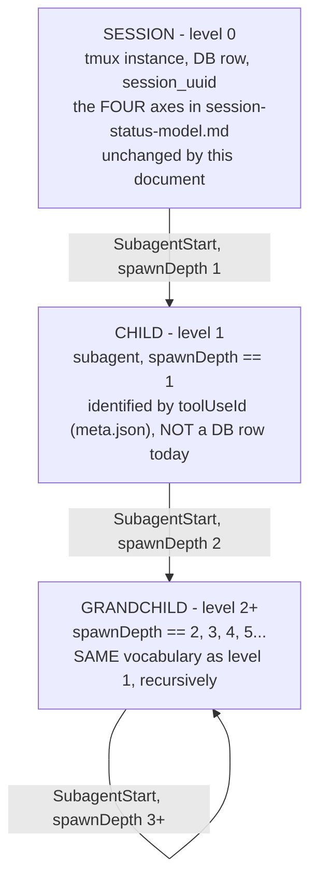
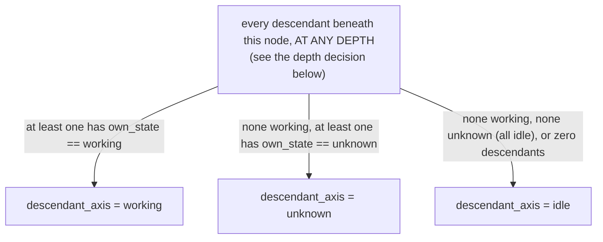

# The alert / hierarchy state model

Design document. Nothing in this file is built. It extends, and in two
places explicitly disagrees with, the four axes charted in
`docs/session-status-model.md` and the 31-event registry in
`src/core/hook_contract.py`. Read both before this. Where this document
gives a symbol path, that symbol exists today; where it proposes one, it
is written as `PROPOSED` or inside the `alert_state_contract.py` file
this document ships alongside, which has no callers yet.

The owner's brief, verbatim, is the spec for section 3:

> we have many hooks to do many things, each hook should have a state,
> then the session object should have children and possibly
> grandchildren and the states on each level will be slightly different.
> like top level that stopped would show an idle light, when viewing the
> tab it is marked read. however if there is still a subagent thats
> working, that would change that sessions state to running. however its
> a subagent not top level so its going to show lighter breathing status
> because its background. however if background agents stop they change
> there session to stopped, but that wouldnt bubble up.

**This document went through two rounds of direct correction from the
owner after its first draft, and both are load-bearing, not cosmetic.**
The first replaced an original roll-up design (own state and descendant
states reduced to one winning value) with a DUAL-AXIS design (own state
sets the color, descendant state sets the animation, and the two never
override each other) - section 3 opens with that correction verbatim.
The second answered four specific questions the dual-axis design still
left open (whether depth modulates the light, how many descendants
reduce to one value, what an unevaluable descendant does, and whether a
`dead`-parent-with-a-working-descendant should be hidden or kept) -
sections 3.1, 3.3 and 3.5 each open with that correction's relevant
answer, quoted. Read section 3 in order; it is written to show its own
history rather than presenting only the final shape.

---

## 0. What is real data and what is not, measured this session

Two facts this design leans on were verified against the live filesystem
on 2026-08-29, not assumed:

1. A subagent's transcript lives at
   `~/.claude/projects/<project-slug>/<session-uuid>/subagents/agent-<hex>.jsonl`,
   with a sibling `agent-<hex>.meta.json` carrying exactly four fields:
   `agentType`, `description`, `toolUseId`, `spawnDepth`. Sampled directly:
   `{"agentType":"general-purpose","description":"...","toolUseId":"toolu_01J...","spawnDepth":1}`.
2. `spawnDepth` is not always 1. Across this machine's own archive:
   2275 subagents at depth 1, 404 at depth 2, 165 at depth 3, 74 at depth
   4, 48 at depth 5. Grandchildren, and great-grandchildren, are routine,
   not a hypothetical the owner's brief invented.

This matters because it means depth is **measured, not inferred** - the
hierarchy model below keys directly on `spawnDepth` rather than counting
edges itself.

What is **not** verified, because nothing in `src/` reads this
filesystem shape today (`src/core/claude_transcript_correlate.py`
explicitly excludes the whole `subagents/` directory rather than parsing
it - see its module docstring): whether `PreToolUse`/`PostToolUse`/
`SubagentStart`/`SubagentStop` hook payloads carry `toolUseId` or any
other field that would let a live hook be attributed to one specific
child among several concurrent ones. `PAYLOAD_EXTRAS` in
`hook_contract.py` documents extras only for `SessionStart`/`SessionEnd`.
This is the single largest gap in the design and it is named again,
precisely, in section 6.

---

## 1. The hook state model

An **event** is a fact that something happened once. A **state** is a
value that persists until something changes it, and that a reader can
ask about at any later time. `hook_contract.py` enumerates 31 events. Of
those, exactly **10 are subscribed** (`HOOK_REGISTRY` rows with
`subscribed=True`); the other 21 are shipped by Claude Code and ignored
by this app today, 20 of them marked `_UNREVIEWED` and one
(`StopFailure`) marked as a known, named gap.

Of the 10 subscribed events, this document classifies each as
state-carrying or a pure event, and if state-carrying, which axis it
writes and whether that state decays:

| Event | Carries state? | Axis | Decays? | Why |
|---|---|---|---|---|
| `UserPromptSubmit` | yes | activity | no (edge, not a level) | clears `question_open`, stamps a fresh heartbeat - it is the event that STARTS a perishable state, not one itself |
| `PreToolUse` | yes | activity | yes, 120s heartbeat | refreshes `last_tool_event_ts`; the state it feeds (`working`) is perishable |
| `PostToolUse` | yes | activity | yes, 120s heartbeat | same as `PreToolUse` |
| `SubagentStart` | yes | activity | yes, 120s heartbeat | increments the session's own `subagent_depth`; feeds `working_subagent` today. Section 3 proposes this becomes an edge into a CHILD node's own state rather than a same-node counter |
| `SubagentStop` | yes | activity | n/a (terminal) | floors `subagent_depth` at 0. Does **not** touch `unread` - see the gap in section 4 |
| `Notification` | yes | activity | yes, 120s heartbeat (same clock as working) | sets `question_open = True` |
| `PermissionRequest` | yes | activity | yes, 120s heartbeat | same as `Notification` |
| `Stop` | yes | activity + a side effect on the durable `unread` flag | n/a (terminal) | clears `question`, floors depth, stamps `last_stop_ts`, and is the ONLY event in this table that sets the durable auto-unread flag |
| `SessionStart` | yes | lifecycle (durable column) | no - lifecycle is not perishable, it is corrected by the reaper, not by a clock | binds `claude_session_uuid`, lineage, `claude_title` |
| `SessionEnd` | yes | lifecycle (durable column) | no | marks the conversation ended |

**Every subscribed event carries state.** None of the 10 is a pure,
consequence-free event in this codebase - which is itself worth stating,
because it means the "which events are pure" question the brief implicitly
raises is answered "none of the wired ones," and the interesting split is
not state-vs-pure but **perishable-vs-durable**:

- **Perishable** (activity axis: `working`, `working_subagent`,
  `question`) - true only as long as a heartbeat keeps refreshing it.
  `WORKING_HEARTBEAT_TIMEOUT_SECONDS = 120` (`session_activity.py:100`)
  is the live-tracker clock; the persisted copy adds a 60s grace on top
  (`activity_persist.py::STALE_AFTER`, 180s) so a restart landing
  mid-heartbeat does not discard a state that was true seconds ago. A
  perishable state that stops being refreshed does **not** become
  `idle` by default - `activity_persist.restore_state` returns a named
  `RESTORE_STALE`, distinct from `RESTORE_OK` and `RESTORE_ABSENT`. This
  three-way split is already the THREE-OUTCOME RULE, already built,
  already tested - the hazard list's own rule, present in the codebase
  before this document existed.
- **Rest** (activity axis: `idle`, `finished_unread`, `unknown`) - true
  until contradicted, not until a clock expires. `activity_persist.py`
  says this explicitly: "a session that was idle an hour ago and has
  received no hook since is still idle."
- **Durable** (lifecycle axis: `running`, `stopped`, `unknown`) - a
  database column, corrected only by the reaper (`reconcile_from_listing`),
  which itself runs only when the home-screen probe runs. Not on a clock
  at all.

**Decay is not optional and this document does not invent a new decay
mechanism.** The hierarchy model in section 3 reuses exactly this
perishable/rest split and exactly this clock, applied to a CHILD node's
own state, rather than defining a second decay policy. A hook that fired
once and never again is not evidence of the current state forever - this
repo's own hazard list is built substantially out of exactly that
mistake (hazard 16's 46-day stale lock, hazard 55's log rotation an
open file descriptor outlives, hazard 23's silent watchdog death) - and
a hierarchy layered on top of the existing model without decay would be
a new instance of the same class.

---

## 2. The hierarchy model

### 2.1 Levels



`spawnDepth` is read directly off the filesystem meta.json, not derived
by counting edges in this app - it already IS the level. This document
therefore does not define a fixed two-level "child/grandchild" enum; it
defines level as `spawnDepth: int`, session is level 0, and every level
`>= 1` uses the identical own-state vocabulary and the same dual-axis
table (section 3). That
answers the "possibly grandchildren" clause literally: depth is
unbounded (measured up to 5 on this machine) and the model does not cap
it.

### 2.2 State vocabulary per level

| Level | Vocabulary | Source | Decays like |
|---|---|---|---|
| 0 (session) | `dead`, `question`, `working`, `finished_unread`, `idle`, `unknown` (`ALL_ACTIVITY_STATUSES` minus `working_subagent` - see 2.3) | `src/core/session_status.py` | as in section 1 |
| ≥1 (child, grandchild, ...) | `working`, `idle`, `unknown` | PROPOSED, `alert_state_contract.py::ALL_CHILD_STATES` | same 120s heartbeat clock, reused not reinvented |

This is where "the states on each level will be slightly different"
gets a concrete, testable answer, and it is a **deliberate, narrower**
choice, not an oversight: `question` and `finished_unread` are dropped
at every level `>= 1` because nothing in the measured hook contract
shows a subagent independently blocking on a user permission prompt or
carrying its own read/unread flag (see the gap list, section 6, item 1
and item 3). If a future Claude Code version gives subagents their own
`Notification`/`PermissionRequest` targeting, this table is the one
place that needs to grow, and `unreviewed_events()` in `hook_contract.py`
is the existing early-warning mechanism for exactly that kind of drift.

**Naming note.** A resting child is named `idle`, not `stopped`. The
owner's own wording for the child vocabulary was "idle, active" and
this document follows it rather than the earlier draft's `stopped`,
for a second reason beyond just matching his words: `stopped` already
has a specific, different meaning on the **lifecycle axis**
(`SESSION_LIFECYCLE_STOPPED` - a tmux instance that is GONE, per
`session-status-model.md`'s own opening paragraph: "`dead` and
`stopped` are not the same thing"). A child that is not currently
between `SubagentStart` and its heartbeat expiring has not gone
anywhere - the subagent process may still exist, mid-thought, between
tool calls - so calling that `stopped` would import a durable-axis word
onto a perishable-axis value it does not mean here. `idle` avoids the
collision and happens to make the child vocabulary `{working, idle,
unknown}` identical in shape to the descendant-axis vocabulary used for
reduction in section 3.1 - not a coincidence, see there.

### 2.3 EXPLICIT DISAGREEMENT with `working_subagent` as an own-state value

`session_status.py` defines `STATUS_WORKING_SUBAGENT` as a **seventh
value of the own-activity axis**, on equal footing with `working` or
`idle`. `session_activity.py` produces it from a same-session integer
counter: `SubagentStart` increments `subagent_depth`, `SubagentStop`
floors it at 0, and `resolve()` reports `working_subagent` whenever
depth > 0 and the heartbeat is fresh.

**Section 3 of this document does not use a roll-up that picks a winner
among own-state and descendant-state; it uses two independent axes,
per the owner's direct correction to the original brief.** Under a
two-axis model, `working_subagent` cannot remain a value of the own
axis and also be what a "breathing idle" or a "breathing working" light
needs to express - the whole point of the correction is that a resting
session with an active descendant must still show its OWN idle color,
merely breathing, not switch to a seventh, unrelated color. Collapsing
"idle, with a working descendant" and "working, with a working
descendant" onto the same `working_subagent` value - which is what the
shipped code does today - is precisely the information loss the owner
flagged as wrong about a roll-up.

**This document therefore disagrees with the shipped code on this one
point, explicitly, per the owner's own direction rather than as a
silent redefinition:** `working_subagent` is retired as an own-axis
value. What it named is re-expressed as the `breathing` animation
(section 3.4) layered on top of whichever own color the session
actually has. An idle session with a working subagent is `idle,
breathing`, not `working_subagent`. A session that is itself `working`
AND has a working subagent is `working, breathing` - a real, useful
distinction the current single-value scheme cannot make at all, since
`resolve()` only ever reports one of `working` or `working_subagent`,
never both facts at once (chart 2, `session-activity.py::resolve`
priority order: hook_seen + fresh heartbeat + `subagent_depth > 0` beats
depth 0, so a session doing its OWN tool call while ALSO running a
background subagent is reported as `working_subagent`, silently losing
"the top-level work is what's actually active"). The dual-axis model
fixes that as a side effect of the correction, not as a separate design
goal.

---

## 3. Status is a DUAL-AXIS FUNCTION, not a roll-up

**This section replaces a roll-up design this document originally
carried, on the owner's direct correction.** The original framing - "given
a node's own state and the multiset of its descendants' states, what
does it display" - was wrong because a roll-up must pick ONE winning
value, and picking a winner destroys information: an idle session with
a working descendant and an actively-working session with a working
descendant would both have collapsed onto the same displayed value. The
owner's words, kept verbatim because they are the spec: *"all children
states which may for now be idle, active paired along with its parent
state will define the status light... working background will always
make it breathe, but breathing color will change based upon the
parent's status."*

The status light is therefore a function of **two independent inputs**
that never collapse into one another:

```
status_light(node) = (color, animation)
color     = f_color(own_state)         -- the node's own axis
animation = f_animation(descendant_axis) -- reduced over every descendant
```

`color` depends only on `own_state`. `animation` depends only on the
reduced descendant axis. Both facts stay visible at once, which is the
entire point of the correction: an idle parent with a working subagent
is `(idle color, breathing)`; an actively-working parent with a working
subagent is `(working color, breathing)` - same animation, different
color, and a viewer can read both without either one hiding the other.

### 3.1 The descendant axis needs its own reduction rule, stated not assumed

Many descendants, at any depth, each carrying their own `own_state`,
reduce to exactly one value on the descendant axis. **The owner's
answer, verbatim: "KISS for now."** The reduction is a simple
existential - if any descendant, at any depth, is working, the axis is
`working`; otherwise it is not. No counting, no intensity scaling with
HOW MANY are working (that residual is named in the gap list). The rule:



Precedence is `working > unknown > idle`, and it is total: defined for
the empty set (`idle` - zero descendants is a positive fact, "nothing
below," not a failed measurement) and for every non-empty multiset
regardless of size. "Any descendant working -> working" is exactly the
rule the correction expected, stated rather than assumed, and it is
also why "two children working, one stops" and "five children working,
four stop" resolve identically (section 3.6). It is kept as ONE named
pure function, `reduce_descendant_axis`, precisely so a future change to
this rule (say, from existential to a count-aware version) is a change
to one function's body, not a rule scattered across every call site that
currently reduces a descendant set by hand.

**Does depth matter to the reduction? ANSWERED BY THE OWNER: no.** Put to
him directly, the answer was explicit: a grandchild working and a child
working produce the SAME descendant-axis value and the same animation.
`spawnDepth` does NOT modulate the light. This document had already
reached the same conclusion for structural reasons (below), and it is
recorded here as a decision the owner confirmed, not merely one this
document argued for on its own. The reasons stand: (1) the owner's own
wording - "breathing... because its background" - describes background
activity as a single fact the user either needs to know about or does
not, with no mention of caring how deep it is; (2) flattening keeps the
function a single pass over a flat list at every node, computed the same
way at every level, rather than a two-pass bottom-up walk that has to
first resolve every descendant's own dual-axis light before it can
compute its ancestor's - simpler, and it is what makes the "no branching
on state names, just add rows" requirement (section 3.4) actually hold
at every level uniformly; (3) it matches the level-vocabulary decision in
2.2 - every level `>= 1` shares one vocabulary, so there is no level-
specific meaning to preserve by keeping depth in the reduction.

**`spawnDepth` is not discarded - it is available, unused, for a future
design.** It still lives in every subagent's `.meta.json` (section 0)
and nothing about this decision removes it from there. Recording that
explicitly so the next reader sees a considered-and-rejected input, not
a fact this document forgot existed: `reduce_descendant_axis`, defined
below, takes no depth parameter at all, by construction, which is how
"not used" is enforced structurally rather than merely asserted in
prose - see the totality test
`test_reduce_descendant_axis_has_no_depth_parameter`. The residual cost
of this choice is real and is named in the gap list (section 6): a user
cannot tell "one thing running two levels down" from "one thing running
five levels down," or "one thing running" from "five things running,"
from the light alone. Both were raised with the owner; both were
answered "KISS for now."

### 3.2 Push vs. derived, and the stuck-state hazard

The owner's rule that a working child propagates up but a stopping child
does not is exactly the shape of a class of bug this repo's own hazard
list is full of: a value that is SET by an event but never reliably
UNSET by its natural counterpart leaves a stale "yes" on screen forever
once the counter-event is missed. Hooks in this app have no delivery
guarantee - `session_activity.py`'s own docstring says so: "hooks POST
over loopback HTTP with a 3s timeout, backgrounded." A design that reads
"parent shows working because a `SubagentStart` was seen" and clears it
only on a matching `SubagentStop` can get stuck showing `breathing`
forever if that one `SubagentStop` is dropped - the exact stuck-forever
shape hazard 16 (a stale restic lock blocking prune for 46 days) and
hazard 55 (a log-rotation fd an exited process never re-opens) both are,
applied to a status light instead of a lock file or a file descriptor.

**Recommendation: DERIVED, not push.** The descendant axis is
recomputed from the current, live `own_state` of every descendant at
read time, never accumulated from a running counter that only an
opposite event can decrement. This is not a new pattern for this
codebase - `session_activity.resolve()` already recomputes activity
from current hook state on every call rather than maintaining a running
verdict, and the existing `subagent_depth` counter (today's only
approximation of this idea) already recovers from a dropped
`SubagentStop` only because it happens to sit under the SAME 120s
heartbeat decay as everything else - it is not actually immune to being
stuck, it is bailed out by a mechanism that exists for an unrelated
reason. A derived model gets that same decay for free and automatically,
because it reads each descendant's OWN currently-decayed `own_state`
rather than an independently-tracked increment/decrement counter.

**The cost, stated plainly.** Derived means every read walks the live
descendant set instead of consulting one integer - O(descendant count)
per read instead of O(1). It also means the descendant SET itself has to
be known at read time, which this document cannot yet guarantee: this is
the same dependency named in section 6 item 1 (no verified per-child hook
identity) and section 0 (no code today reads `subagents/*.jsonl`/`.meta.json`
at all). A derived model does not remove that dependency; it makes the
dependency explicit and load-bearing rather than optional, which is the
honest tradeoff to accept in exchange for a design that cannot get
permanently stuck. No reason was found to prefer push over derived here,
so derived is the recommendation without qualification.

### 3.3 The third outcome per axis - and why `unknown` is not `idle` wearing
   its clothes

The correction's point 3 answers a question this document had not yet
settled: what does an UNEVALUABLE descendant do to the light? The
owner's framing, kept close to verbatim because the distinction is
easy to blur: *"an unknown descendant state must not manufacture
activity... but it must not be silently laundered into idle either."*

Two different things were being asked for, and they are not in tension
once separated onto the two places this document already keeps separate
- the ANIMATION and the DATA:

- **On the animation axis, `unknown` contributes nothing.** It does not
  breathe. A vanished subagent - one whose `SubagentStart` fired and
  whose heartbeat then expired with no matching `SubagentStop` ever
  observed - must not keep its ancestor breathing forever on the
  strength of a signal that stopped arriving. That would be a status
  light nobody could trust, the same shape as this repo's hazard 23 (a
  watchdog whose own death looks identical to good news) applied to an
  animation instead of a mail check. So `unknown`'s animation is
  `steady` - the SAME animation value `idle` produces. This is the
  "defaults safe" the owner asked for: safe against a STUCK CLAIM of
  activity, not safe in the sense of pretending nothing is wrong.
- **In the underlying data, `unknown` is never coerced into `idle`.**
  `reduce_descendant_axis` still returns the literal string `unknown`,
  a real, distinct third value of `DESCENDANT_AXIS_STATES` - it is never
  rewritten to `idle` anywhere in this contract. `status_light` returns
  the full `LightRow` it matched, not a bare `(color, animation)` pair,
  specifically so the `descendant_axis` field a caller receives back
  still says `unknown` even on the rows where `animation` happens to
  read `steady`. A renderer that wants to show a small caveat glyph
  alongside a non-breathing dot can do so by reading `descendant_axis`;
  a renderer that only reads `animation` sees the safe, non-breathing
  default. Both readings are honest, because both are computed from the
  same real fact, never from a value that was thrown away.

Put the other way round: `(idle, idle)` and `(idle, unknown)` are two
DIFFERENT rows of `LIGHT_TABLE`, both rendering `animation=steady`
today, and remaining two different rows is the entire point. Collapsing
them into one row - reusing the `idle` row for an `unknown` descendant
instead of giving `unknown` its own - would be exactly the false-green
class this repo's hazard list keeps finding in itself: a
could-not-evaluate answer reported as a clean one because nothing
downstream bothered to keep them apart.

### 3.4 The table is the extension point, not a function body

The correction is explicit that the contract's centerpiece must be a
literal table - `(own_state, descendant_axis) -> (color, animation)`,
now widened to also carry a `contradiction` flag (3.5) - and that
adding a state must mean adding a row, never editing branching logic.
`alert_state_contract.py::LIGHT_TABLE` is written as literal, enumerated
row data for exactly this reason, covering the full cross product for
both node kinds:

| Node kind | own_state values | descendant_axis values | rows |
|---|---|---|---|
| session (level 0) | `dead`, `question`, `working`, `finished_unread`, `idle`, `unknown` (6) | `working`, `unknown`, `idle` (3) | 18 |
| child (level ≥1) | `working`, `idle`, `unknown` (3) | `working`, `unknown`, `idle` (3) | 9 |

**Every row today follows two simple invariants, and the table is built
so a FUTURE row can break either invariant without any code change:**

- `color` always equals `own_state`, on every row - the owner's rule
  that color "comes entirely from the parent's own state" holds for
  every combination measured so far.
- `animation` depends only on `descendant_axis`, on every row:
  `working -> breathing` (absolute, see 3.5 - the owner's words are
  "will always make it breathe," and this table honors that literally,
  with no exception carved out for `dead` or any other own_state),
  `unknown -> steady`, `idle -> steady` (3.3 - the two share a value on
  the animation axis while remaining two distinct rows).

Because both are true for every row today, the table is *currently*
separable into two one-dimensional rules, and the animation rule is
currently only TWO-valued (`breathing` / `steady`) rather than
three-valued, because `unknown` deliberately shares `idle`'s animation
without sharing its row. **It is still stored as the full cross
product, not as two separate lookups**, because the correction
anticipates more states arriving soon, and the day a new own_state
needs an exception to either invariant (for instance, a future state
that should animate differently even for the same descendant_axis),
that exception is one row's `animation` (or `color`) column changed - a
data edit, not a rewrite of a formula two functions deep. Nothing in
`alert_state_contract.py` computes `color` or `animation` from a formula
at call time; both are looked up, and `status_light` returns the row
itself so no field is ever dropped on the way out.

### 3.5 The one cell that is a deliberate contradiction, kept for cleanup

The correction's point 4, and it reverses an instinct this document had
before being corrected: when a session is `dead` - a confirmed,
authoritative, terminal fact from tmux, not a guess - and a descendant
is KNOWN to be `working` (not `unknown` - a real, currently-heartbeating
subagent), the light KEEPS BREATHING. **This document does not add a
rule that a dead parent forces the descendant axis quiet, and was
explicitly told not to.** The owner's reasoning: that combination is
physically impossible in steady state - a subagent is a subprocess of
the pane's own process (design doc gap, still unverified this session -
see section 6) and should not be able to out-survive it - so seeing it
IS the signal that something did not clean up. Suppressing it would
delete the one piece of evidence that a cleanup problem exists.

`LIGHT_TABLE`'s row for `(session, dead, working)` therefore carries
`contradiction=True`, the only row in the table where that field is set.
It is not a special code path - `status_light` performs the same lookup
it always does and this row simply carries an extra `True` alongside its
`color`/`animation` like any other field a row can hold. It is named
explicitly, per the correction, "so it reads as 'this is wrong, look at
it' rather than as a normal state" - a caller that surfaces
`contradiction` (a maintenance/debug view, an alert-on-this-condition
rule) can single this exact combination out from the 26 ordinary rows
without inventing a new light color or a special-cased comparison
against `dead` and `working` by name.

**Why this is a different cell from the `unknown` rows in 3.3, and both
had to be decided rather than merged into one rule.** They look similar
- both are "the descendant axis says something odd" - and they get
opposite treatment on purpose. An `unknown` descendant is a MISSING
signal: no evidence either way, and the safe default is to render as if
nothing is happening while still recording the uncertainty in the data.
A `dead`-parent-with-`working`-descendant is a PRESENT, POSITIVE signal
that is being taken at face value specifically because it should not be
possible - the safe default there is the opposite one: keep showing it,
loudly, because tidying it away is what would manufacture the false
green. The owner's own framing draws this line precisely: "the safety
[in 3.3] is against a STUCK CLAIM, not against telling the truth" - and
3.5 is a case where telling the truth means refusing to look away from a
claim that should not exist.

No other row in either node kind's vocabulary carries `contradiction`.
Only the session axis has a terminal, process-death fact (`dead`); the
child vocabulary (`working`, `idle`, `unknown`) has no equivalent state
today, so no analogous cell arises for a child-with-grandchild
combination - noted here so a future reader does not go looking for one
that was intentionally not created, rather than one that was missed.

### 3.6 Answering the owner's own test case

> if a parent is idle and TWO children are working and one stops, what
> does the parent show?

Descendant axis, from the flat reduction in 3.1: `{working, working}` ->
`working` (at least one is enough). Table lookup: `(idle, working) ->
(idle color, breathing, contradiction=False)`. One child stops: the flat
set is now `{working, idle}` -> reduction is still `working` (still at
least one). Table lookup is unchanged. **This is derivable from the rule
as stated, not a gap** - the reduction in 3.1 was written precisely so
this case has one answer regardless of how many descendants are active,
and that is also exactly why it cannot answer a different question:
whether the light should look any different between "one descendant
working" and "five." It does not, under this rule, and that residual is
named in section 6.

---

## 4. Read / unread across the hierarchy

The owner ties "read" to viewing: *"when viewing the tab it is marked
read."* The existing mechanism, unchanged by this document:

- `mark_session_viewed(session_id)` clears the **auto** unread flag,
  fired when a WS terminal actually binds to a session
  (`src/core/session_manager.py:1421`, called from
  `src/api/websocket.py`'s `bind_session`). This is a session-level (level
  0) operation, keyed on `tmux_name`.
- A **manual** unread flag is a separate, sticky bit
  (`set_manual_unread`) that viewing does **not** clear - the user has to
  clear it explicitly. This is the "survives being viewed" case the
  docstring names directly.
- The only writer of auto-unread=True today is `Stop` at level 0
  (`session_manager.py:2156`, gated on `kind == EVENT_STOP`).

**What clears.** Viewing a level-0 tab clears only that tab's own auto
flag. There is no per-child unread flag anywhere in the current schema -
`unread_store` is keyed on `tmux_name`, and a child has no `tmux_name` of
its own (it is a subagent process inside the parent's pane, not a
separate tmux instance). So today, and under this design, **"read"
exists only at level 0.** A child cannot independently be "read" or
"unread" because it has no independent surface the user views.

**Can a descendant un-read an ancestor that was already marked read?**
This is not answered by the owner's brief and this document does not
invent an answer - it is the first item in the gap list. What can be
said from the measured code: nothing today sets auto-unread from a
`SubagentStop` (see section 1's table - `SubagentStop` only floors
`subagent_depth`; it does not touch `unread_store`). So under the
CURRENT wiring, a background subagent finishing while the user is not
looking produces **no** unread signal at all, even though the analogous
event at level 0 (`Stop`) is the ONLY thing that sets it. That is very
likely an oversight rather than a decision - it means a session whose
foreground work is done and whose only remaining activity is a
background subagent can finish that subagent's work with nothing to
tell the user it happened. Named precisely, not silently carried forward,
in section 6.

**What happens when a session is viewed while a descendant is still
working?** Viewing clears the level-0 auto flag exactly as it does
today (nothing about a live descendant changes that - the flag and the
activity display are different axes, per the "four state machines are
independent" rule this whole model is built on). Section 3's dual-axis
function keeps returning `animation=breathing` for as long as the
descendant axis reduces to `working`, entirely independent of whether
the tab is marked read - `color` and `read/unread` are two more axes
that never collapse into each other. A read, breathing session is a
real, intended combination under this model: "you've seen the recent
turn, and something is still quietly running underneath it."

---

## 5. The machine-readable contract

`src/core/alert_state_contract.py`, shipped alongside this document,
mirrors the shape of `hook_contract.py` on purpose so the same kind of
drift test this repo already relies on (`test_status_model_chart_drift.py`,
`test_hook_contract.py`) can be pointed at it later:

- `SESSION_OWN_STATES`, `CHILD_OWN_STATES` - the two own-axis
  vocabularies from section 2.2, as tuples (ordered, for stable table
  generation and stable test iteration), not prose.
- `DESCENDANT_AXIS_STATES` - `(working, unknown, idle)`, section 3.1.
  Three values, kept distinct even though two of them currently share an
  animation - see 3.3.
- `ANIMATION_BREATHING`, `ANIMATION_STEADY` - the two animation values
  actually produced today, as named constants, never bare strings at a
  call site. There is no `ANIMATION_UNCERTAIN`: an earlier draft of this
  module had one, and it was removed after the correction settled that
  `unknown` must not manufacture its own animation (3.3) - an unused
  third animation value sitting in the vocabulary would have been the
  same kind of furniture this repo's hazard 30 warns about (a check, or
  here a value, that never fires and should have been removed rather
  than left to look load-bearing).
- `LightRow` (frozen dataclass): `node_kind`, `own_state`,
  `descendant_axis`, `color`, `animation`, `contradiction` - one instance
  per table row. `status_light` returns the matched `LightRow` itself,
  not a bare `(color, animation)` pair, specifically so `descendant_axis`
  (the fact 3.3 requires stay inspectable) and `contradiction` (the flag
  3.5 requires stay visible) are never dropped between the table and the
  caller.
- `LIGHT_TABLE: Tuple[LightRow, ...]` - the full 18 + 9 = 27 rows from
  section 3.4, written out literally, one row per line, so a diff on
  this file shows exactly which combination changed. Exactly one row -
  `(session, dead, working)` - carries `contradiction=True` (section
  3.5).
- `reduce_descendant_axis(states: Sequence[str]) -> str` - section 3.1,
  pure, total, flat over depth (no depth parameter at all - depth not
  entering the function signature is itself how "depth does not matter"
  is enforced, not merely documented), existential ("any working wins" -
  KISS, per the owner) rather than count-aware.
- `status_light(own_state, descendant_axis, node_kind) -> LightRow` - a
  single `LIGHT_TABLE` lookup, no branching on state names; raises
  `ValueError` only when the `(node_kind, own_state, descendant_axis)`
  triple is not a row's key, which a completeness test (below) proves
  can only happen for a vocabulary member nobody has added a row for
  yet, never for an in-domain combination.
- `missing_light_rows(node_kind) -> Tuple[Tuple[str, str], ...]` - the
  completeness check the correction requires as a property, not a
  one-off assertion: computes the full cross product of that node kind's
  own-axis and descendant-axis vocabularies and returns every pair with
  no matching row. An empty result is the "the table is complete" fact;
  a non-empty one names exactly which `(own_state, descendant_axis)`
  pairs were left unaddressed - the failure mode the correction's point
  2 exists to catch when a state is added to a vocabulary without adding
  its rows.
- `HookStateRole` + `HOOK_STATE_REGISTRY` - one row per event in
  `hook_contract.ALL_HOOK_EVENTS` (imported, not copied), stating
  `carries_state`, `axis`, `perishable`, `decay_seconds`. Completeness
  against `ALL_HOOK_EVENTS` is asserted the same way
  `hook_contract.py`'s own registry is - every event exactly once.
- No I/O, no imports outside the standard library plus
  `src.core.hook_contract` (for the event-list parity check) and
  `src.core.session_status` (for the shared state-name strings, so this
  file spells no session-axis literal itself, matching the existing rule
  that `session_status.py` is the one place a display string is spelled).

---

## 6. The honest gap list

1. **No verified per-child identity in the hook payload.** Section 0's
   central finding. `SubagentStart`/`SubagentStop` fire at the parent
   session's hook endpoint; `PAYLOAD_EXTRAS` documents no field on either
   event that would say WHICH child (by `toolUseId` or otherwise) started
   or stopped. Building real child nodes as this document proposes
   requires either (a) Claude Code adding that field, unverified whether
   it already exists and is simply undocumented in this contract, or (b)
   deriving liveness from the `subagents/*.jsonl` files' own growth,
   which has no measured heartbeat semantics in this codebase and was
   not tested this session. Until one of those is confirmed, "child has
   its own decaying `working` state" is a specification, not a
   measurement - exactly the caveat `session-project-operations.md`
   already uses for the CLI-fork section.

2. **Whether subagents can independently block on the user.** The child
   vocabulary in 2.2 deliberately excludes `question`. Whether a
   sub-agent tool call can itself trigger a `Notification` or
   `PermissionRequest` targeted at that child (rather than always
   surfacing through the parent) was not verified against a live Claude
   Code build this session. If it can, `CHILD_OWN_STATES` gains a value
   and `LIGHT_TABLE` gains the three rows that value needs -
   `missing_light_rows(NODE_KIND_CHILD)` would report exactly those three
   as missing until they are added, which is the completeness mechanism
   doing its job rather than a manual audit having to catch it.

3. **Read/unread has no per-child concept, and whether it should is
   unresolved by the brief.** Section 4 names this directly: does a
   background child finishing set the parent's auto-unread, the way
   `Stop` does at level 0? The current code's answer is "no, nothing
   does this," which reads more like an oversight in the existing
   `working_subagent` feature than a deliberate choice - but the owner's
   brief does not say, and this document does not invent the answer.

4. **The descendant axis cannot express COUNT or DEPTH, by explicit,
   confirmed decision, and the owner's own test case exposes exactly
   this.** One active descendant and five active descendants render
   identically (`breathing`); a working direct child and a working
   depth-5 great-grandchild also render identically (section 3.1,
   answered directly by the owner as "no" and "KISS for now"). This is
   recorded here as a DEFERRED residual, not an oversight: `spawnDepth`
   remains available in every subagent's `.meta.json` (section 0) if a
   future design wants it, and `reduce_descendant_axis` is kept as one
   named function (3.1) specifically so adding count- or depth-awareness
   later is a change to that one function's body, not a rule to hunt
   down across scattered call sites.

5. **Whether `dead` can ever ACTUALLY co-occur with a `working`
   descendant was not verified, even though the table now treats the
   combination as meaningful rather than merely filling a cell.** Section
   3.5 is not a totality filler any more - the owner confirmed
   `(session, dead, working)` should render, breathing, as a DELIBERATE
   cleanup signal, and the row now carries `contradiction=True` to say
   so explicitly. What remains unverified this session is the structural
   assumption underneath why that combination would be notable at all:
   whether a subagent process can actually survive its parent pane
   dying. If it turns out a live subagent categorically cannot outlive a
   dead pane, `contradiction=True` will simply never be observed in
   practice, which is a fine outcome for a signal that exists for
   cleanup visibility - but if it turns out subagents CAN outlive a dead
   pane under some circumstance this session did not check, the flag is
   exactly as useful as intended and this note can be removed once that
   is confirmed.

6. **The derived (pull) descendant axis in 3.2 depends on knowing the
   live descendant set, which nothing in `src/` currently enumerates.**
   Recommending "derived, not push" solves the stuck-state hazard on
   paper, but it is not a free win: it trades a stuck-forever risk for a
   hard dependency on gap 1 (per-child hook identity) or an equivalent
   filesystem-scan mechanism, neither of which exists today. Until one
   of those is built, `status_light`'s `descendant_axis` input has no
   real source to read from - it is specified, not wired.

7. **Everything in `docs/session-status-model.md`'s own two closing
   sections still applies and is not re-litigated here.** In particular:
   the reaper is not on a timer (item 7 there), so a level-0 `stopped`
   render is only as fresh as the last home-screen probe; this document's
   descendant axis inherits that same staleness for any ancestor whose
   own lifecycle read is itself unreconciled. Nothing in this document
   makes the reaper run more often.

8. **Runtime behavior of the proposed dual-axis model was not exercised
   against the live instance.** As with `session-status-model.md`'s own
   disclosure, everything above is read from source plus one filesystem
   sample (section 0); nothing was run against 10.0.1.150, which is
   read-only for this work per the task's own constraints.
