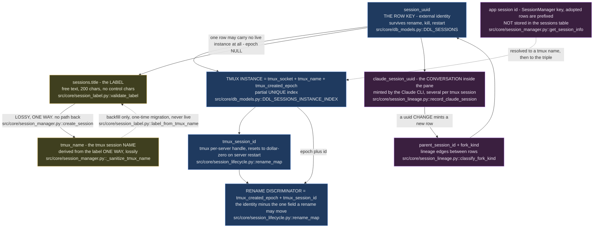
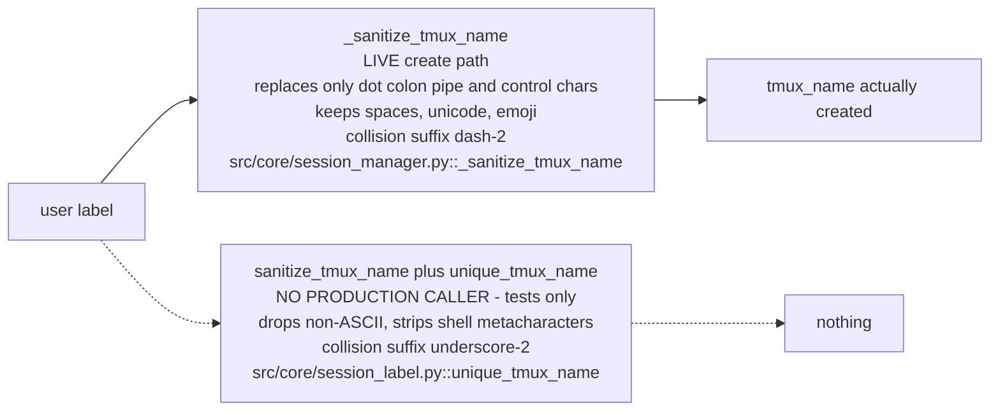
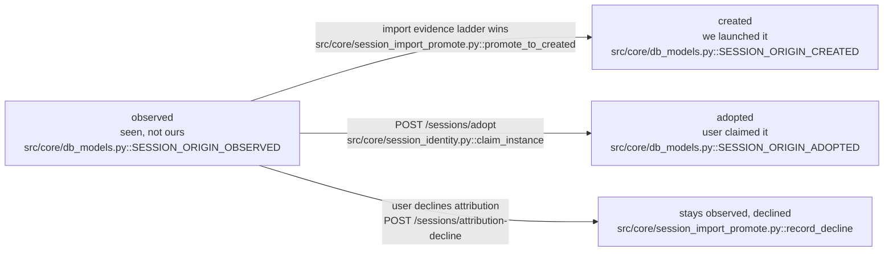
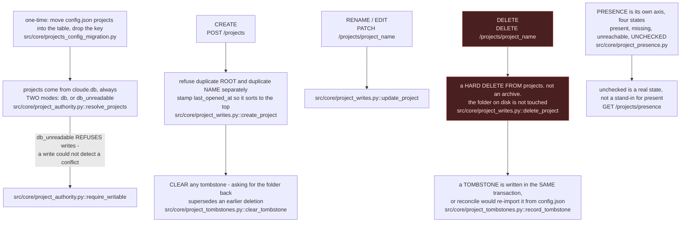
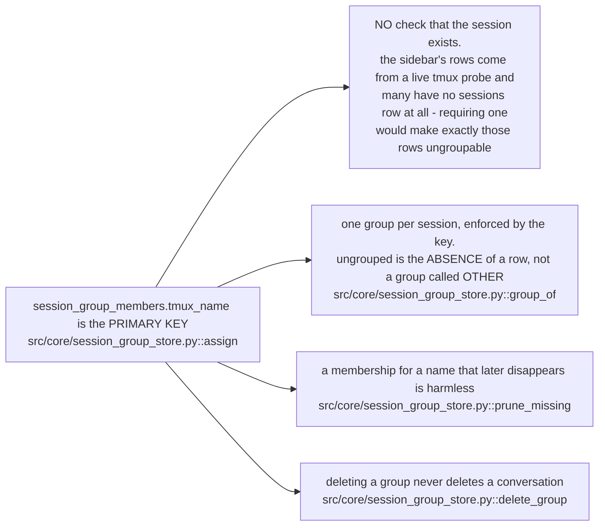
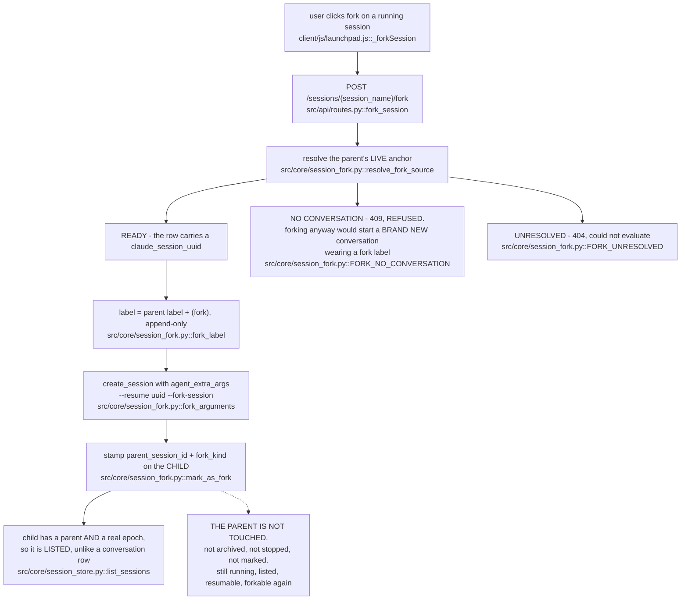
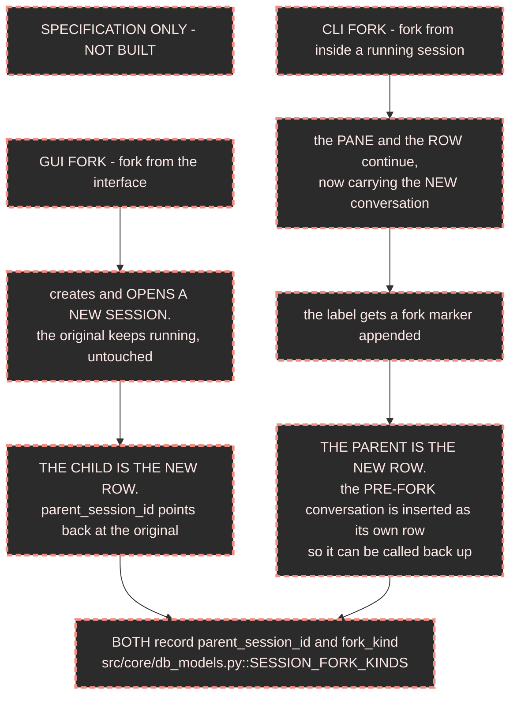
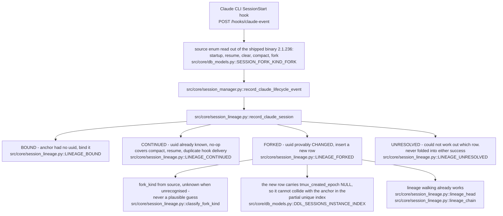

# Session and project OPERATIONS, derived from the code

Scope: what each operation actually does to a session row, a project row and
the tmux session underneath. The STATUS model - how a session's activity light
is computed - is a separate document and is not covered here.

Derived by reading `src/`, `client/js/` and `macOS/` at branch
`fix/ended-sessions-visibility`. Verified 2026-08-26.

## How to read the citations, and the drift test that enforces them

Every node and edge below carries the file and symbol it was derived from, in
one of exactly two machine-checkable forms:

| Form | Means | Example |
|---|---|---|
| `path/to/file.py::symbol` | that file defines that top-level or method symbol | `src/core/session_label.py::set_label` |
| `METHOD /route` | a router in `src/api/` declares that route | `POST /sessions/adopt` |

`tests/test_docs_operations_chart_drift.py` parses THIS FILE, extracts every
citation of both forms, and asserts each one resolves in the code. Rename a
symbol or a route and the chart fails the suite instead of quietly becoming
fiction. The test is deliberately dumb - it proves the chart's vocabulary is
real, it cannot prove the arrows are right.

Anything marked **NOT IMPLEMENTED** is specification, not code. It is drawn
because the decision has been made, and it is fenced off so nobody reads it as
a description of the shipped build.

---

## 1. Object identity

Everything else depends on this. Five different identifiers are in play and
three of them get called "the session id" in conversation.

Four properties that make the rest of the document work:

1. **`session_uuid` is the row key. `claude_session_uuid` is the conversation.**
   One tmux instance holds MANY conversations in sequence - start, `/clear`,
   fork, compact. The table expresses that with one ANCHOR row keyed on the
   instance triple, plus one row per later conversation carrying
   `tmux_created_epoch = NULL` so it cannot collide with the anchor. See the
   module docstring of `src/core/session_lineage.py`.
2. **The label is not the name.** `sessions.title` is what the user typed.
   `tmux_name` is an internal handle derived from it. The derivation is one
   way and lossy; nothing reverses it at runtime.
3. **The rename discriminator takes BOTH halves.** Epoch alone is
   one-second resolution; `tmux_session_id` alone resets per tmux server
   lifetime. `src/core/session_lifecycle.py::rename_map` drops a
   discriminator seen twice in one listing rather than guessing.
4. **Adoption keys on the full triple, never the name.** tmux reuses names,
   so a name-keyed claim can land on a stranger's process -
   `src/core/session_identity.py::claim_instance`.

### The filter, and the fact that there are TWO of them

The brief describes one lossy label-to-name filter. The code has two, and the
one that documents itself as "THE FILTER" is not the one the create path runs.

Both are cited so the drift test holds them; the divergence is recorded in
section 6.

---

## 2. Session operations

One chart, one row per verb. Read the box colours: blue writes identity, amber
writes display only, grey writes nothing at all.

```mermaid
graph TD
    classDef idw fill:#1f3a5f,stroke:#8ab4f8,color:#e8eaed
    classDef disp fill:#3f3f1f,stroke:#e0c060,color:#f1f1e0
    classDef nowrite fill:#2b2b2b,stroke:#909090,color:#e0e0e0
    classDef kill fill:#4a1f1f,stroke:#f28b82,color:#fce8e6

    %% ---------- CREATE ----------
    C0["CREATE<br/>POST /sessions"]:::idw
    C1["mint tmux name from project name<br/>src/core/session_manager.py::_sanitize_tmux_name"]
    C2["spawn tmux session, launch agent<br/>src/core/session_manager.py::create_session"]
    C3["FRESH listing taken after the spawn"]
    C4["record row origin=created, lifecycle=running<br/>src/core/session_create_persist.py::persist_creation"]
    C5["stamp projects.last_opened_at, best effort<br/>src/core/project_writes.py::touch_project_by_path"]
    C0 --> C1 --> C2 --> C3 --> C4 --> C5
    C3 -.->|"listing failed - CANNOT DETERMINE, no row written<br/>src/core/session_create_persist.py::CREATE_LISTING_UNAVAILABLE"| CX["session is live and unattributed<br/>a later adopt repairs it"]:::nowrite
    C3 -.->|"listing ran, name absent - session died on spawn"| CY["no row - a row here would claim a session that is not there<br/>src/core/session_create_persist.py::CREATE_SESSION_GONE"]:::nowrite

    %% ---------- ADOPT ----------
    A0["ADOPT<br/>POST /sessions/adopt"]:::idw
    A1["fresh listing gate<br/>src/core/session_adopt_persist.py::persist_adoption"]
    A2["THE SIGHTING - insert or merge, origin=observed<br/>src/core/session_identity.py::record_instance"]
    A3["THE CLAIM - origin moves to adopted, one way<br/>src/core/session_identity.py::claim_instance"]
    A4["adopted_at is FIRST-WRITE-WINS via COALESCE"]
    A0 --> A1 --> A2 --> A3 --> A4
    A1 -.->|"listing did not run - never rendered as gone"| AX["no write<br/>src/core/session_adopt_persist.py::PERSIST_LISTING_UNAVAILABLE"]:::nowrite
    A1 -.->|"listing ran, name absent - 409 session_gone"| AY["NO ROW MARKED ADOPTED<br/>src/core/session_adopt_persist.py::AdoptTargetGoneError"]:::nowrite
    A3 -.->|"row exists but is stopped"| AZ["refused - claiming a corpse is permanent<br/>src/core/session_identity.py::ADOPT_NOT_RUNNING"]:::nowrite

    %% ---------- RESPAWN ----------
    R0["RESPAWN a dead pane<br/>POST /sessions/respawn"]:::nowrite
    R1["probe the pane - dead flag, dead status, start command<br/>src/core/session_respawn.py::RESPAWN_PANE_FORMAT"]
    R2["classify: agent, replay, shell, not_dead, cannot_determine<br/>src/core/session_respawn.py::resolve_respawn_plan"]
    R3["respawn-pane into the SAME tmux session<br/>src/core/tmux_backend.py::respawn"]
    R4["SAME ROW. ZERO DATABASE WRITES.<br/>session_created is unchanged, so the triple is unchanged,<br/>so row, project, theme, unread and label all survive<br/>src/core/session_manager.py::respawn_session"]:::nowrite
    R0 --> R1 --> R2 --> R3 --> R4
    R2 -.->|"probe did not answer - 200 with ok=false"| RX["cannot_determine, nothing run<br/>src/core/session_respawn.py::RESPAWN_CANNOT_DETERMINE"]:::nowrite

    %% ---------- RENAME ----------
    N0["RENAME - label only<br/>PATCH /sessions/session_id/name"]:::disp
    N1["validate: non-empty, 200 chars, no control chars<br/>spaces, punctuation and non-ASCII all ACCEPTED<br/>src/core/session_label.py::validate_label"]
    N2["read the epoch from a fresh listing to KEY the write<br/>src/core/session_manager.py::set_session_label"]
    N3["UPDATE title only. tmux_name, tmux_created_epoch and<br/>tmux_session_id appear ONLY in the WHERE clause<br/>src/core/session_label.py::set_label_for_instance"]
    N4["broadcast session.renamed to attached sockets"]
    N0 --> N1 --> N2 --> N3 --> N4
    N3 -.->|"NO tmux rename happens. no 409, no 500."| N5["two sessions may share a label -<br/>a label identifies nothing"]:::disp

    %% ---------- EXTERNAL RENAME ----------
    E0["EXTERNAL rename - user renames in tmux directly"]:::idw
    E1["row goes absent under its stored name at the next listing"]
    E2["discriminator matches a live row under a DIFFERENT name<br/>src/core/session_lifecycle.py::rename_map"]
    E3["MOVE the row's tmux_name. do not reap it.<br/>src/core/session_lifecycle.py::_reap_absent_instances"]
    E0 --> E1 --> E2 --> E3
    E2 -.->|"two stored rows share one discriminator"| EX["no rename applied - not a coin flip<br/>src/core/session_lifecycle.py::_reap_absent_instances"]:::nowrite

    %% ---------- CLOSE / END ----------
    K0["CLOSE / END - kill the process"]:::kill
    K1["DELETE /sessions - the ACTIVE session<br/>also rmtree of the uploads bucket<br/>src/core/session_manager.py::destroy_session"]:::kill
    K2["DELETE /sessions/external/name - any other tmux session<br/>kill-session directly, skips adoption,<br/>so a dead-pane session can still be cleaned up<br/>src/core/session_manager.py::destroy_external_session"]:::kill
    K3["row is NOT deleted. next complete listing reaps it to<br/>lifecycle=stopped and keeps last_seen_running_at<br/>src/core/session_lifecycle.py::reconcile_from_listing"]
    K0 --> K1 --> K3
    K0 --> K2 --> K3

    %% ---------- DELETE ----------
    D0["DELETE a record - SOFT<br/>DELETE /sessions/records/session_uuid"]:::disp
    D1["stamp archived_at and nothing else. ROW IS RETAINED.<br/>first stamp wins, second call reports already-deleted<br/>src/core/session_store.py::archive_session"]
    D2["disappears from every stored listing<br/>src/core/session_store.py::listable_sessions"]
    D3["kills no process, touches no file, removes no uploads.<br/>deleting a RUNNING session merely unlists it and the<br/>reconciler keeps updating it underneath, unseen"]
    D0 --> D1 --> D2
    D1 --> D3
```

**Archive versus delete, stated plainly.** There is one soft-delete verb for
sessions and it writes `sessions.archived_at`. There is no separate user-facing
"archive" - the column IS the delete. `src/core/session_store.py::archive_session`
is its only writer; nothing in `src/` issues `DELETE FROM sessions`.

**Origin is a one-way ladder.** `observed` can be promoted to `created` by the
import re-run, and `observed` can be claimed to `adopted`. Neither has a path
back.

---

## 3. Project operations, and how they differ from sessions

Projects are **DB-only**. The mirrored `projects` key in `config.json` is gone;
a one-time migration moves anything the file still holds into the table and
removes the key.

**The asymmetry is deliberate and worth stating once.** Deleting a SESSION is
soft, because history and transcripts are built on the row. Deleting a PROJECT
is hard plus a tombstone, because the row's only job is to be a launcher entry.
`projects.archived_at` exists in the schema and no code path writes it.

### Sidebar groups key on `tmux_name`, on purpose

---

## 4. FORK

> **GUI FORK IS BUILT. CLI FORK IS STILL SPECIFICATION.**
> Shipped 2026-08-26 on `feat/gui-fork`: `POST /sessions/{session_name}/fork`,
> a `fork` control on every owned running session row, and
> `src/core/session_fork.py`. The CLI-fork shape in 4.1 is still unbuilt,
> and it is the INVERSE of what ships - read 4.1 before assuming the two
> are the same feature.

### 4.0 What the GUI fork actually does - THIS PART IS BUILT

**There is no "was forked from" state, and that is deliberate.** The parent
process is never touched by a fork, so recording a state on it would be
writing a verdict about a session that is alive. "Was this forked from" is a
reverse lookup - `src/core/session_fork.py::children_of` - which costs nothing
and cannot go stale.

The fork arguments travel THROUGH the user's own wrapper rather than around
it (`src/config.py::Settings.get_agent_command`, `extra_args`), because the
wrapper is where their auth is set up. They are deliberately not gated on
`accepts_model`: that flag is about consuming an OpenRouter model id, and
gating the fork flags on it would make a fork through a modelless wrapper
silently launch a fresh conversation instead of the forked one.

### 4.1 The two fork shapes, as specified

The two differ in **which side gets the new row**, and that is the whole design
decision. GUI fork: the new row is the CHILD. CLI fork: the new row is the
PARENT, because the running pane keeps its identity and it is the abandoned
conversation that needs somewhere to live.

### 4.2 What already exists to support it - THIS PART IS BUILT

Also present and unused by any fork UI: the schema columns
`parent_session_id` and `fork_kind`, their index
`src/core/db_models.py::DDL_SESSIONS_PARENT_INDEX`, and the reopen inputs
`claude_session_uuid` plus `working_dir` on the row.

**The detector does NOT decide intent.** A fork is measured from a CHANGED
conversation uuid; `source` only names the KIND. `rename` and `fork` are
separated by INSTANCE EVIDENCE and never by intent - a fork is a genuinely new
tmux session with its own creation epoch, so it can never match an existing
rename discriminator. See the comment block in
`src/core/session_lifecycle.py::_reap_absent_instances`.

### 4.3 DECISIONS - both answered by the owner, 2026-08-26

| # | Question | ANSWER |
|---|---|---|
| F-1 | Does a forked-away PARENT get its own state, or does it reuse `archived_at`? | **NEITHER. The parent is not touched at all.** In neither fork shape does the parent die: a CLI fork keeps the same process, and a GUI fork spawns a second one alongside it. So there is no state to record - it stays running, listed, resumable and forkable again. `archived_at` keeps its single meaning, "the user deleted this from their lists". Asserted by `tests/test_session_fork.py::test_marking_a_fork_leaves_the_parent_byte_identical`. |
| F-2 | What does the fork marker do on a SECOND fork? | **Append.** `name(fork)(fork)`. Not deduplicated, not numbered, not capped. The owner's words: "it should never get like that, and it will need to be renamed, but thats my job." Inventing a scheme would be guessing at an intent already stated. |

---

## 5. Where each operation is triggered from

The same word means different things on different paths. This table is why.

| Operation | Web UI | Tray - macOS Electron | HTTP route | Hook | Reconcile |
|---|---|---|---|---|---|
| create | `client/js/launchpad.js`, `client/js/terminal.js` via `client/js/api.js::createSession` | none | `POST /sessions` | - | - |
| adopt a SESSION | `client/js/session-sidebar-clicks.js`, `client/js/launchpad.js` via `client/js/api.js::adoptSession` | none | `POST /sessions/adopt` | - | sighting row can be written by import |
| adopt a SERVER | - | `macOS/adoption-decision.js` - **different object entirely**, decides whether this bundle may take over a server already on the port | - | - | - |
| respawn | `client/js/session-sidebar-clicks.js`, `client/js/launchpad.js` via `client/js/api.js::respawnSession` | none | `POST /sessions/respawn` | - | - |
| rename - label | three controls, all on one shared validator `client/js/session-label.js`: `client/js/session-sidebar-rename.js`, `client/js/launchpad.js`, `client/js/terminal.js` | none | `PATCH /sessions/session_id/name` | - | - |
| rename - external | - | - | - | - | `src/core/session_lifecycle.py::_reap_absent_instances` moves `tmux_name` |
| close / end | `client/js/api.js::destroySession`, `client/js/api.js::destroyExternalSession` | none | `DELETE /sessions`, `DELETE /sessions/external/name` | - | reaper stamps `stopped` |
| delete a record | `client/js/launchpad.js` via `client/js/api.js::deleteSessionRecord` | none | `DELETE /sessions/records/session_uuid` | - | - |
| fork - GUI | `client/js/launchpad.js::_forkSession` via `client/js/api.js::forkSession` | none | `POST /sessions/session_name/fork` | - | parent untouched by construction; `src/core/session_fork.py::children_of` derives the relationship |
| fork - CLI | **NOT IMPLEMENTED** | **NOT IMPLEMENTED** | **NOT IMPLEMENTED** | lineage rows are written by `POST /hooks/claude-event` | - |
| project create / edit / delete | `client/js/api.js::createProject`, `client/js/api.js::updateProject`, `client/js/api.js::deleteProject` | none | `POST /projects`, `PATCH /projects/project_name`, `DELETE /projects/project_name` | - | `src/core/project_reconcile.py` re-reads config.json on start |
| group assign | `client/js/session-sidebar-group-actions.js` - drag, menu and keyboard picker all land on one write | none | `POST /session-groups/assign` | - | `src/core/session_group_store.py::prune_missing` |

**The tray is read-only over sessions.** It polls `GET /sessions/list`
through `macOS/tray-api.js` and renders counts in `macOS/tray-status.js`. It
creates, renames and deletes nothing.

**The reconciler is not on a timer.** It runs inside the attachable-sessions
probe the home screen already pays for, and only when that listing is both `ok`
and complete - `src/core/session_manager.py::reconcile_lifecycle`.

---

## 6. Where the code contradicts the common description

Recorded because a chart that quietly smooths these over is worse than no
chart.

1. **There are TWO label-to-tmux-name filters, and the documented one is
   dead.** `src/core/session_label.py::sanitize_tmux_name` and
   `src/core/session_label.py::unique_tmux_name` have no caller in `src/` or
   `client/` - only tests. The live create path uses
   `src/core/session_manager.py::_sanitize_tmux_name`, which is far more
   permissive: it keeps spaces, unicode and emoji, replaces only `.`, `:`, `|`
   and control characters, and uniquifies with a `-2` suffix rather than `_2`.
   Any statement of the form "the filter drops non-ASCII" describes the dead
   one.

2. **The shipped lineage writer puts the NEW conversation in the NEW row -
   the opposite of the CLI-fork specification in 4.1.** On `FORKED`,
   `src/core/session_lineage.py::record_claude_session` inserts a row carrying
   the NEW `claude_session_uuid` with `parent_session_id` pointing at the head,
   and stamps that new row `lifecycle` stopped. The anchor row - the one keyed
   to the live tmux instance - keeps the OLD uuid. Specification 4.1 says the
   pane's row should carry the NEW conversation and the PRE-FORK conversation
   should become the new row. These are not the same write, and implementing
   4.1 means changing this function, not adding to it.

3. **Consequence of 2, worth its own line: after any `/clear`, compact-fork or
   `--fork-session`, the anchor row's `claude_session_uuid` is stale relative
   to what is actually running in the pane.** The current conversation is on a
   lineage row marked stopped. Any reader that resolves "which conversation is
   in this pane" from the anchor gets the previous one.

4. **Two client rename controls still handle a 409 the server can no longer
   produce.** `client/js/launchpad.js` and `client/js/terminal.js` both branch
   on `/409/` and "already in use". The rename surface stopped renaming tmux,
   so duplicate labels are legal and no 409 exists on that path - see the
   docstring of `rename_session_endpoint`. Dead branch, not a defect with a
   symptom.

5. **"Adopt" names two unrelated operations.** A SESSION adopt claims a tmux
   instance. A SERVER adopt - `macOS/adoption-decision.js` - decides whether a
   freshly launched bundle may take over an HTTP server already listening on
   the port. They share no code and no object.

---

## 7. What this document does NOT establish

- It does not prove the arrows are correct. The drift test proves only that
  every cited symbol and route exists.
- Activity status, unread state and toast lifecycle are out of scope; the
  status model is charted separately.
- `session_import`, the first-run one-way import that seeds `observed` rows, is
  drawn only where it feeds the origin ladder. Its evidence tiers are not
  charted.
