# The session status model

Derived from source on branch `fix/ended-sessions-visibility` (base tag
`v1.0.5`, `6240396`). Every state and every transition below cites the file and
symbol it was read out of. If a citation and this prose disagree, the citation
wins - and `tests/test_status_model_chart_drift.py` fails the build when the
state names here and the constants in the code stop matching.

**Charts 2, 2b and 2c were re-derived on 2026-09-13** against
`src/core/attention/`, when the activity axis stopped being fed by Claude Code
lifecycle hooks and started being read off disk. The other five charts are
unchanged and still cite the branch above.

## There are FOUR state machines, not one

They are independent. A session has a value in all four at once, and no value
in any one of them determines a value in another.

| # | Axis | Where it lives | Who writes it | Survives a restart |
|---|------|----------------|---------------|--------------------|
| 1 | **Activity** | nothing durable: RE-READ from disk on every pass | `src/core/attention/resolve.py::resolve_attention`, projected by `attention/display.py::to_display` | n/a, it is a reading |
| 2 | **Lifecycle** | `sessions.lifecycle` column | `src/core/session_lifecycle.py::reconcile_from_listing` and the create/adopt/import writers | yes |
| 3 | **Origin** | `sessions.origin` column | `src/core/session_identity.py::claim_instance`, the create path, the import path | yes |
| 4 | **Deleted** | `sessions.archived_at` column | `src/core/session_store.py::archive_session` - the ONLY writer | yes |

A fifth thing, the **tray**, is not a session state at all. It is a derived
view over a *set* of sessions plus server health. Chart 6 shows that
relationship rather than listing its states beside the others.

The single most useful sentence in this document: **`dead` and `stopped` are
not the same thing and are not even on the same axis.** `dead` (activity) is a
tmux session that still EXISTS, holding a pane whose process exited - you can
attach to it, respawn into it, kill it. `stopped` (lifecycle) is a tmux
instance that is GONE - there is nothing to attach to and nothing to kill, only
a stored row. See `client/js/session-status-ui.js` `STATUS_LABELS.stopped`,
which says so in the label text itself.

---

## Chart 1 - Activity, the tmux-only classifier

The pure function. No hooks, no I/O, no persistence.
Source: `src/core/session_status.py::resolve_pane_status`.

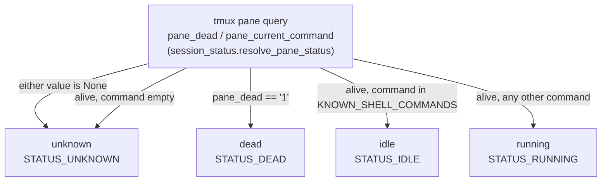

These four are `ALL_STATUSES` (`session_status.py:58`).
`KNOWN_SHELL_COMMANDS` is `session_status.py:134` - `zsh bash sh dash ksh fish
tcsh csh`.

**What the code admits it cannot do.** The module docstring
(`session_status.py:24-33`) refuses to derive "waiting for user input" from
tmux, because a pane query cannot tell thinking from blocked. That refusal is
why chart 2 exists, and the four tiers in chart 2 are the evidence that answers
the question tmux cannot.

---

## Chart 2 - Activity, the four evidence tiers and the rungs that read them

Source: `src/core/attention/resolve.py::resolve_attention`, a PURE function
that opens no file and reads no clock. Rewritten on 2026-09-13: the previous
version of this chart was driven by Claude Code lifecycle hooks arriving at an
in-memory tracker, and **the app now installs no hooks at all**
(`docs/DECISIONS.md`, "Zero hooks"). Nothing announces a state any more;
everything is READ.

**The four tiers, and what each one is allowed to say.** Precedence is the
order below, and no tier may say more than its column allows.

| Tier | Source | May say | May NEVER say |
|---|---|---|---|
| registry | `~/.claude/sessions/<pid>.json`, claude's own record of itself, rewritten in place on every status change (`attention/registry_read.py`) | `busy`, `needs_user`, `done_idle` | anything about a pane it is not joined to |
| transcript | the tail of `~/.claude/projects/<slug>/<uuid>.jsonl` (`attention/transcript_facts.py`, 256 KB window) | `busy`, `needs_user` | `done_idle` on its own |
| pane | the last block of `capture-pane` text (`attention/pane_markers.py`) | `needs_user` | `done_idle`, ever, by any path |
| tmux | `#{pane_dead}` (`session_pane_death.py`) | `dead` | anything about what the agent is doing |

The registry is the only tier that may ORIGINATE rest, because it is the only
one that carries claude's own statement that it has stopped. The pane can only
ever confirm that a dialog is on screen: a screen with no dialog on it is not a
finished turn, it is a screen with nothing on it.

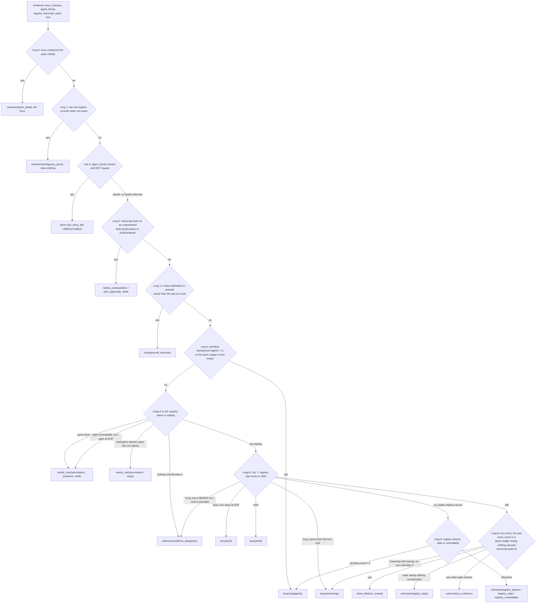

**Four verdict states, and the fourth is an answer, not a failure.**
`done_idle`, `needs_user`, `busy`, `unknown`. `unknown` carries its own named
reasons, it raises nothing, and it is NEVER rendered as `idle`.

**The order of rungs 2, 3 and 4 is the whole design, and it is not the order
the plan proposed.** The plan put the unanswered-blocking-tool test below both
background-agent rungs. A real `AskUserQuestion` tail was replayed carrying
`pending_background_agents=1`, so under that order a session parked on a
question while an agent ran answered `busy(subagents)` and the question was
never raised. Background agents do not unblock a human dialog, so the direct
record of the dialog outranks the count. The code's own numbering is what this
chart draws; `resolve.py`'s docstring lists all five places it deviates from
the plan and why.

**No `or 0` appears anywhere in the resolver.** A count that was not written is
None, None satisfies no rung, and the session lands on `unknown`. That single
rule is what removes the 410 false "done" toasts measured over 50.8 hours: every
one of them was a missing number read as zero.

### Chart 2b - the projection onto the eight names

Source: `src/core/attention/display.py::to_display`. **THE EIGHT STATE NAMES
STAY EIGHT.** The resolver answers four states with a reason each; this module
maps those pairs onto names `src/core/session_status.py` already defines and
adds none of its own.

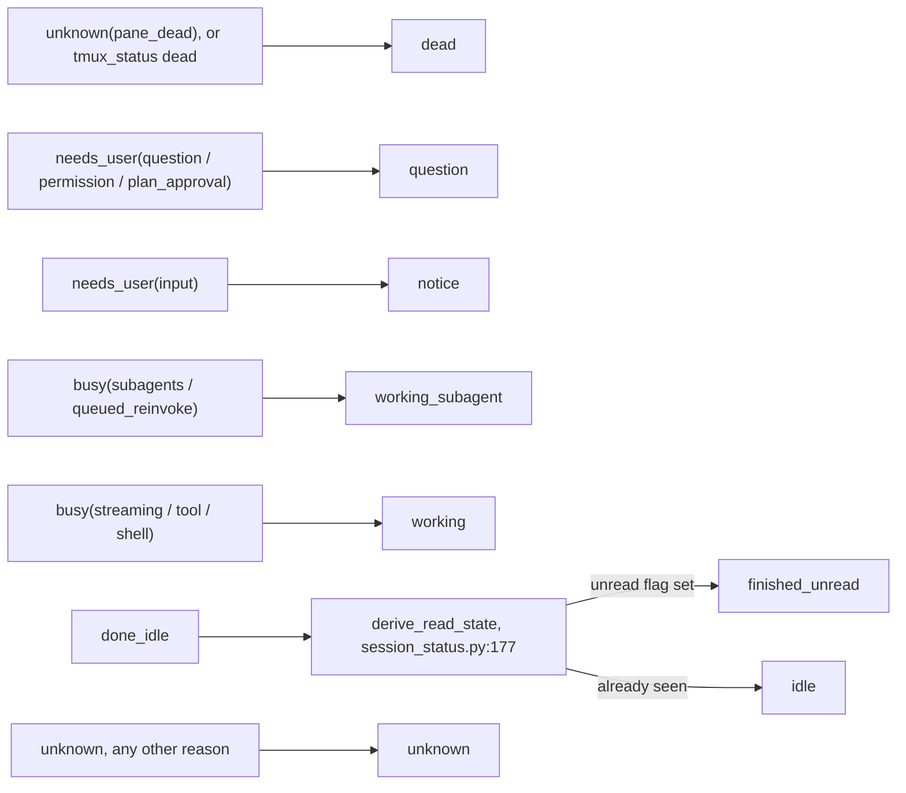

These eight are `ALL_ACTIVITY_STATUSES`. `ACTIVITY_STATUS_PRIORITY` lists the
same eight in urgency order and is documented as consulted by no resolver in
this codebase.

`done_idle` does NOT pick between `idle` and `finished_unread` itself. Those are
one session at rest seen through one flag, and `derive_read_state` is the single
place that flag is applied; re-deriving it here would give the project a second
half-rule.

`question` and `notice` were ONE state until 2026-09-08. `question` is the agent
STOPPED until a human answers; `notice` is claude wanting attention while not
blocked. The split now comes from the verdict's REASON rather than from two
hook flags: `question`, `permission` and `plan_approval` paint `question`, and
`input` alone paints `notice`. A `needs_user` reason the table does not list
paints `question`, which fails toward the human.

**`running` is in `ALL_STATUSES` and NOT in `ALL_ACTIVITY_STATUSES`.** That is
deliberate and documented at `session_status.py:98-102`: a raw tmux `running`
is mapped onto `working` before it ever reaches a client.

### Chart 2c - the edge detector, and where a toast comes from

Source: `src/core/attention/ledger.py::AttentionLedger.observe`, raised by
`src/core/attention/watcher.py`. The resolver answers every two seconds for
every live session and almost every answer repeats. A toast is raised on the
EDGE, and the ledger is the only thing in the package that remembers anything.

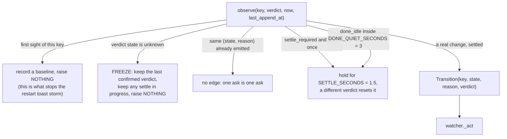

The key is the INSTANCE, `UnreadStore.compose_key(tmux_name, epoch)`, not the
session id. Gotcha 4b and gotcha 10 are both about the two diverging.

Which toast each edge raises, and what else it does, is in
`docs/notifications.md`. Nothing else in the app raises a status toast.

---

## Chart 3 - the graceful-degradation map

Source: `src/core/session_activity.py::map_tmux_fallback`. It is no longer on
the live status path: chart 2 owns that. What is left is
`SessionManager.list_attachable_sessions` (`session_manager.py:6143`), whose
rows have no running process bound to them, so there is no registry record and
no live transcript to resolve. tmux plus the stored unread flag is genuinely all
there is for such a row.

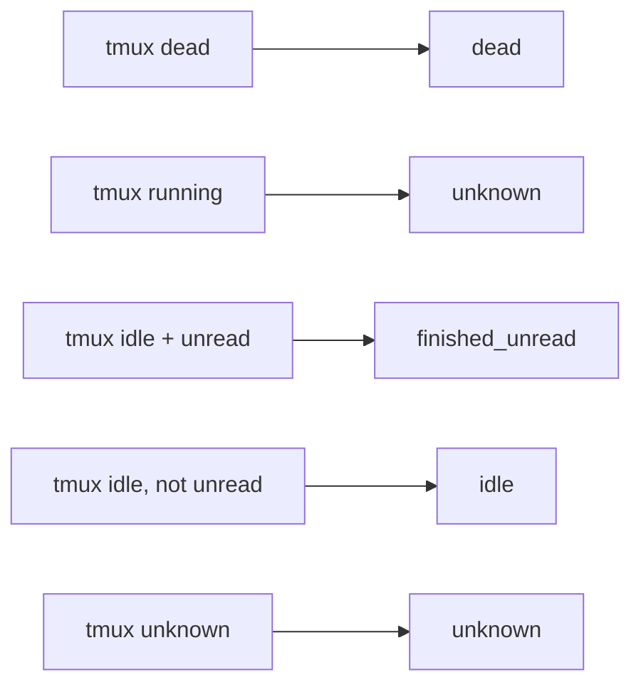

This function never fabricates `question`, `notice` or `working_subagent` -
there is no signal to base them on.

---

## Chart 4 - Lifecycle, the durable column

Source: `sessions.lifecycle`, values `src/core/db_models.py:168-175`
(`SESSION_LIFECYCLES`). Default in the DDL is `'unknown'`
(`db_models.py::DDL_SESSIONS`).

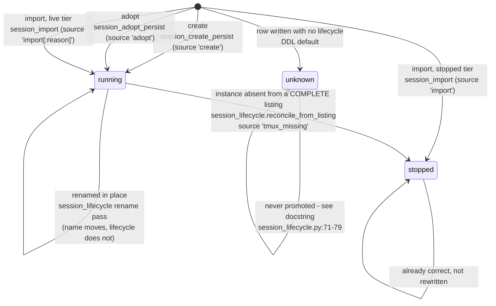

**The reaper refuses in three named ways rather than guessing.** Outcome tokens
`src/core/session_lifecycle.py:112-129`:

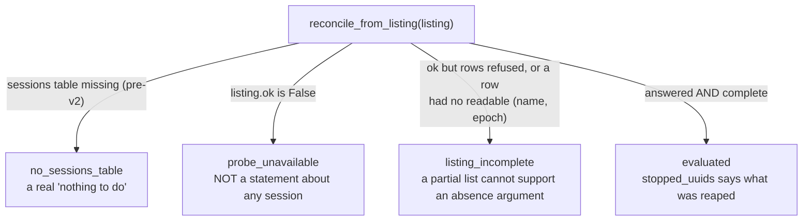

`evaluated=False` carries no uuids and `examined=0` on every refusal branch.

`ReconcileOutcome.evaluated=False` carries no uuids and `examined=0`
(`_not_evaluated`, `session_lifecycle.py:179`). "I looked and nothing died" and
"I could not look" are different facts.

`SESSION_LIFECYCLE_SOURCE_PROBE_FAILED` (`db_models.py:179`) exists and is
**never written on purpose** - pinned by
`test_probe_failed_source_is_never_written` and explained at
`session_lifecycle.py:60-72`. Writing `unknown` on a transient tmux hiccup
would destroy a `running` value the app does believe.

### When does the reaper run

Not on a timer. `SessionManager.reconcile_lifecycle` has exactly one caller:
`SessionManager.list_attachable_sessions` (`src/core/session_manager.py:4160`),
which is the home-screen probe. The comment there says so explicitly - it runs
where the probe is already paid for.

---

## Chart 5 - Origin and Deleted

Origin: `src/core/db_models.py:145-161`. Deleted: `sessions.archived_at`,
sole writer `src/core/session_store.py::archive_session`.

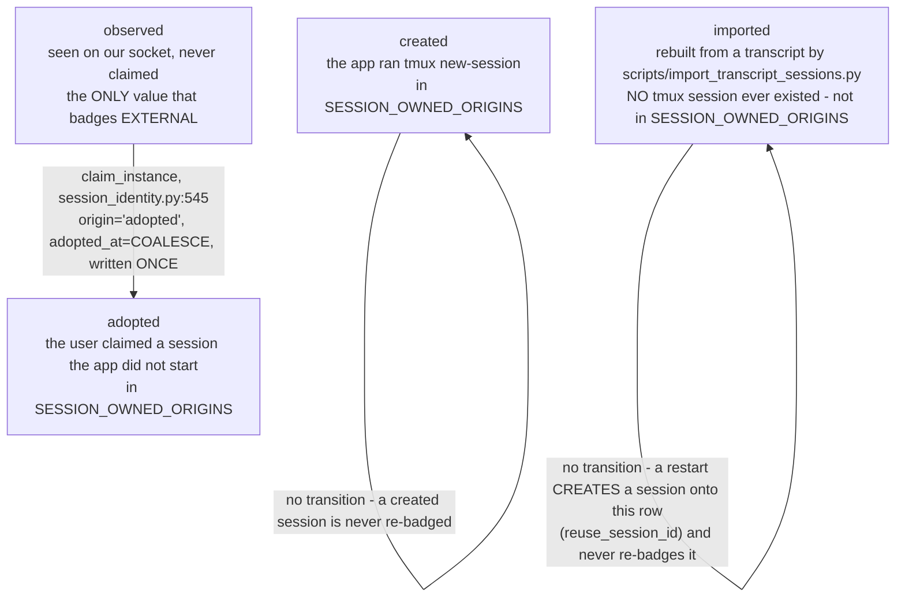

`observed` is the only value that renders as external (`db_models.py:144`).

`imported` is a FOURTH kind, not a flavour of `observed`. `observed` means a
live pane was seen on our socket and not claimed - a measurement of a process.
An imported row has no pane, no socket presence and no epoch, and never had
one; it carries a `claude_session_uuid` and nothing else that could identify a
process. It is deliberately absent from `SESSION_OWNED_ORIGINS`, which
`session_store.owned_names`/`owned_instances` read to answer "which tmux
sessions on this socket are ours" - there is no tmux session to own. Restarting
one goes through `src/core/session_imported_restart.py`, not the pane path.
`claim_instance` refuses a row whose `lifecycle = 'stopped'` (the SQL's
`AND lifecycle != ?` guard) - you cannot adopt a corpse.

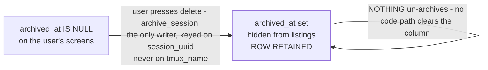

`archive_session` is idempotent and the first stamp wins
(`session_store.py:360`, `WHERE ... AND archived_at IS NULL`). The reaper
reconciles archived rows but never touches the column
(`session_lifecycle.py:81-91`), so a deleted row can never come back through
RECENT.

### The one inclusion rule

`src/core/session_store.py::listable_sessions` - "the ONE spelling of what
belongs on a screen", added because RECENT and the project tree each carried
their own and disagreed.

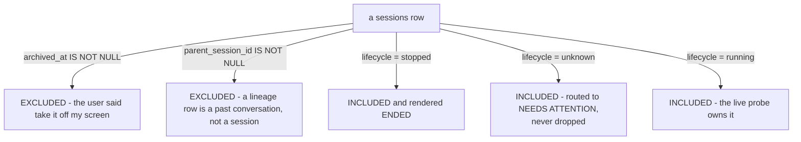

`needs_attention` (`session_store.py:398`) selects
`lifecycle='unknown' OR project_attribution='unknown'`, with `archived_at IS
NULL` deliberately OUTSIDE the parenthesised OR - inside it, the attribution
arm would have kept the hole the lifecycle arm just lost.

---

## Chart 6 - the tray is a DERIVED view, not a fifth axis

Source: `macOS/tray-status.js` - `TRAY_STATES` (line 78), `deriveTrayState`
(132), `countSessionSignals` (96), `ATTENTION_STATUSES` (64).

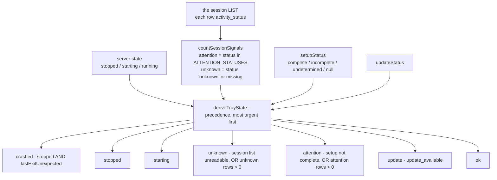

`ATTENTION_STATUSES` is `['question', 'finished_unread', 'dead']` - three of
the seven activity states. `unknown` is deliberately excluded from it: a
measurement failure is not an alarm, and it routes to the `unknown` tray state
instead so it cannot masquerade as a definite one
(`tray-status.js:58-60`).

Only ONE unknown escalates the icon: an undeterminable session list. The
update check routinely cannot reach GitHub and is not allowed to pin the icon
forever - "a warning that never clears is not a monitor"
(`tray-status.js:29-38`). Nothing is dropped; `describeSignals` reports every
signal's own three-state verdict into the tooltip.

---

## Chart 7 - what tmux does to a session, and who observes it

The transitions that cross axes.

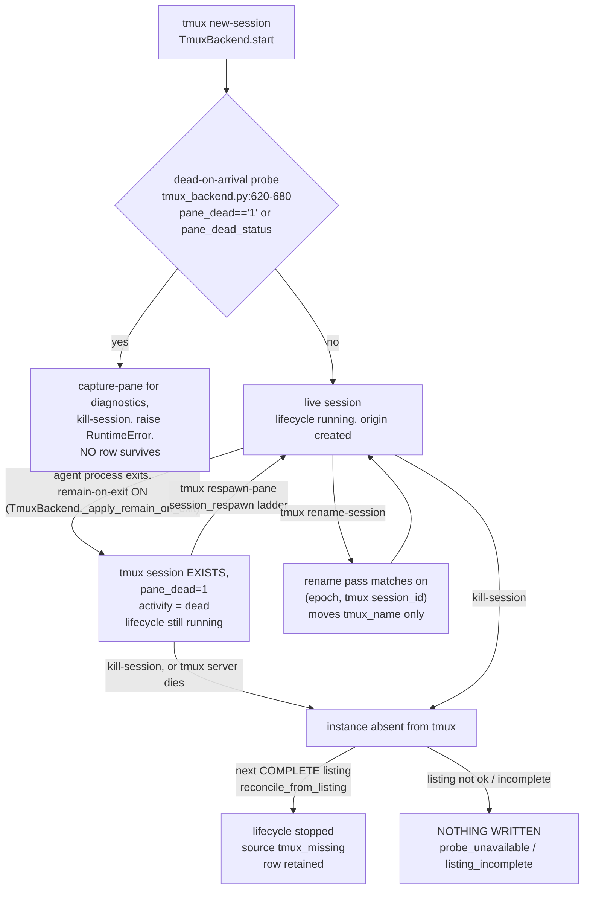

**Why the corpse state is important.** `remain-on-exit on` is set globally
before any window exists (`tmux_backend.py:304-332`) and re-asserted per
session (`:588`) and on adopt (`:875`). It is the reason `dead` is reachable at
all: without it the session would simply vanish and the user would only ever
see `stopped`.

**Respawn's six outcomes** (`src/core/session_respawn.py`), gated on
`pane_start_command` rather than on `sessions.agent_type` - that column is
written on every create whether an agent was started or not, so trusting it
would launch an agent into a console the user believes is his own shell:

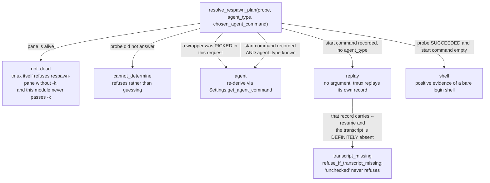

`transcript_missing` is applied AFTER the ladder, by the caller, once
`session_transcript_presence` has come back with a definite absence. It exists
because a replay hands tmux back its own start command and 3 of the 19 live
sessions on the owner's box carry an explicit `--resume <uuid>` in theirs; a
resume against a deleted transcript exits at once and leaves a dead pane the row
still calls running.

**A PICKED WRAPPER OUTRANKS THE GATE.** An `agent_type` supplied in the restart
request (the picker, `client/js/session-restart-picker.js`) is consulted BEFORE
`pane_start_command` and reaches `agent` even from an empty one. The gate exists
because a STORED `agent_type` is not evidence of intent; a wrapper the user just
picked is. It does not outrank `not_dead` or an unanswered probe.

**The rung can also be PREDICTED without acting.** `project_restart_rung` is the
same ladder tail reached without the liveness gate, so
`GET /sessions/restart/preview` can say what a LIVE session would come back AS.
It never returns `not_dead`, and it is a prediction, never a permission -
`pane_state_from_probe` (`dead` / `alive` / `unknown`) carries liveness as its
own fact and is what a button must obey.

`shell` and `cannot_determine` are kept apart on purpose. A respawn matches the
SAME row and never writes a new one - the tmux `session_created` value is a property of the
session, not the pane's process, so the identity triple `(tmux_socket,
tmux_name, tmux_created_epoch)` is unchanged (`session_respawn.py:12-21`).

**The rename discriminator** is `(creation epoch, tmux session_id)` -
`session_lifecycle.py::rename_map`. Neither half is sufficient: the epoch is
one-second resolution, and the tmux `session_id` resets to `$0` on every tmux server
restart. A discriminator seen twice in one listing is DROPPED, not resolved -
picking either would be a verdict nobody measured.

---

## STATE INVENTORY - the machine-readable half

`tests/test_status_model_chart_drift.py` reads the block below and asserts it
BOTH ways against the code, then asserts every name in it actually appears
inside a mermaid chart on this page. Adding a state to the code without adding
it here fails the build; naming a state here that no longer exists in the code
fails the build too.

Format: `state | axis | defining symbol`.

```state-inventory
running | activity | src/core/session_status.py::STATUS_RUNNING
idle | activity | src/core/session_status.py::STATUS_IDLE
dead | activity | src/core/session_status.py::STATUS_DEAD
unknown | activity | src/core/session_status.py::STATUS_UNKNOWN
question | activity | src/core/session_status.py::STATUS_QUESTION
notice | activity | src/core/session_status.py::STATUS_NOTICE
working | activity | src/core/session_status.py::STATUS_WORKING
working_subagent | activity | src/core/session_status.py::STATUS_WORKING_SUBAGENT
finished_unread | activity | src/core/session_status.py::STATUS_FINISHED_UNREAD
running | lifecycle | src/core/db_models.py::SESSION_LIFECYCLE_RUNNING
stopped | lifecycle | src/core/db_models.py::SESSION_LIFECYCLE_STOPPED
unknown | lifecycle | src/core/db_models.py::SESSION_LIFECYCLE_UNKNOWN
created | origin | src/core/db_models.py::SESSION_ORIGIN_CREATED
adopted | origin | src/core/db_models.py::SESSION_ORIGIN_ADOPTED
observed | origin | src/core/db_models.py::SESSION_ORIGIN_OBSERVED
imported | origin | src/core/db_models.py::SESSION_ORIGIN_IMPORTED
evaluated | reconcile | src/core/session_lifecycle.py::RECONCILE_EVALUATED
probe_unavailable | reconcile | src/core/session_lifecycle.py::RECONCILE_PROBE_UNAVAILABLE
listing_incomplete | reconcile | src/core/session_lifecycle.py::RECONCILE_LISTING_INCOMPLETE
no_sessions_table | reconcile | src/core/session_lifecycle.py::RECONCILE_NO_TABLE
agent | respawn | src/core/session_respawn.py::RESPAWN_AGENT
replay | respawn | src/core/session_respawn.py::RESPAWN_REPLAY
shell | respawn | src/core/session_respawn.py::RESPAWN_SHELL
not_dead | respawn | src/core/session_respawn.py::RESPAWN_NOT_DEAD
cannot_determine | respawn | src/core/session_respawn.py::RESPAWN_CANNOT_DETERMINE
transcript_missing | respawn | src/core/session_respawn.py::RESPAWN_TRANSCRIPT_MISSING
crashed | tray | macOS/tray-status.js::TRAY_STATES
attention | tray | macOS/tray-status.js::TRAY_STATES
unknown | tray | macOS/tray-status.js::TRAY_STATES
starting | tray | macOS/tray-status.js::TRAY_STATES
stopped | tray | macOS/tray-status.js::TRAY_STATES
update | tray | macOS/tray-status.js::TRAY_STATES
ok | tray | macOS/tray-status.js::TRAY_STATES
```

The `archived` axis has no state vocabulary of its own - `archived_at` is a
timestamp or NULL, so it is asserted by the test as a two-valued column rather
than by name.

---

## Where the code disagrees with itself

Found while deriving this. Each is a real inconsistency in the tree at
`c8865c0`, not a stylistic preference.

1. **`ALL_STATUSES` and `ALL_ACTIVITY_STATUSES` are not nested sets.**
   `running` is in the first and not the second; `question`, `notice`,
   `working_subagent` and `finished_unread` are in the second and not the
   first. This is documented
   (`session_status.py:98-102`) and correct, but it means "a status" has no
   single membership test in this codebase and every validator has to say
   which vocabulary it means.

2. **The client's status vocabulary is a third set that matches neither.**
   `client/js/session-status-ui.js` `STATUS_LABELS` has NINE keys: the seven
   `ALL_ACTIVITY_STATUSES` plus `stopped` (a *lifecycle* value, not an
   activity one) plus `running` (an activity value the unified vocabulary
   deliberately excludes, kept as a back-compat alias mapping onto the
   `working` dot class). The dot the user looks at is therefore rendering two
   axes through one switch.

3. **`launchpad.js` tests for a lifecycle value the schema cannot hold.**
   `_endedSessionsForTree` (`client/js/launchpad.js:2888`) accepts
   `rec.lifecycle === 'stopped' || rec.lifecycle === 'dead'`. `SESSION_LIFECYCLES`
   is `running / stopped / unknown` (`db_models.py:171`) and nothing anywhere
   writes `lifecycle='dead'` - grep for a writer returns nothing. The `dead`
   arm is unreachable. It is harmless today and it is exactly the conflation
   that item 2 makes easy.

4. **`lifecycle_source` has no canonical set, and the set that looks canonical
   is incomplete.** `db_models.py:178-181` names four tokens (`tmux_list`,
   `probe_failed`, `tmux_missing`, `import`) and there is no
   `SESSION_LIFECYCLE_SOURCES` tuple to validate against. Two more values are
   minted elsewhere and never added: `"adopt"`
   (`session_adopt_persist.py:71`) and `"create"`
   (`session_create_persist.py:78`). A seventh shape exists as a composite,
   `f"import:{verdict.reason}"` and `f"import:rerun:{verdict.reason}"`
   (`session_import.py:535, 694`). Of the four "canonical" ones,
   `probe_failed` is deliberately never written and `tmux_list` is written
   only by `session_lineage.py:467`.

5. **`ACTIVITY_STATUS_PRIORITY` documents an ordering nothing consults.**
   `session_status.py:115-119` says so itself. It is a comment with a type
   annotation. Harmless, but a reader can reasonably assume it arbitrates
   something.

6. **`unknown` rendered identically to `idle` until this branch.**
   `client/css/status-dot.css:113-147` records the repair: the two were "two
   colour rules" that came out pixel-identical, and `unknown` is now a
   genuinely transparent-centred **hollow** ring - shape, not hue, so it
   survives the three themes that zero every radius token. `stopped` is
   deliberately FILLED and not hollow, because a stopped session is a
   measured fact, not a could-not-measure.

7. **The reaper is not on a timer, though it is often described as one.**
   Its single caller is the home-screen probe
   (`session_manager.py:4160`). There is no scheduled reconcile anywhere in
   `src/`. A machine whose home screen is never opened never reaps, and
   nothing in the model says otherwise.

## What I could not evaluate

- **Whether the `dead` arm in `_endedSessionsForTree` was ever reachable.** It
  is not reachable at `c8865c0`. Whether an older schema or an import path
  once wrote `lifecycle='dead'` is not answerable from this tree.
- **Runtime behaviour.** Everything above is read from source. Nothing was run
  against the live instance on 10.0.1.150, which is read-only for this work.
